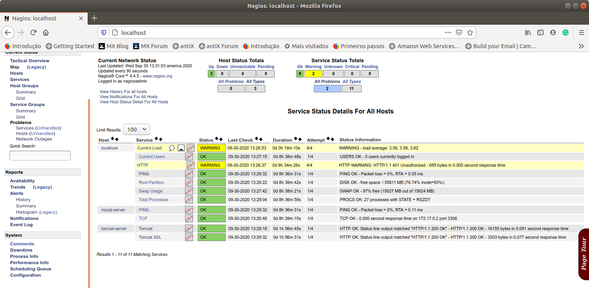

# 3.7 Recuperando de Problemas

Conforme observado nas seções anteriores, o Nagios Core é uma das ferramentas disponíveis para realizar o monitoramento de infraestrutura e, emitir alertas para que ações possam ser tomadas de modo a viabilizar a rápida intervenção na restauração dos serviços.

No nosso exemplo, após o encerramento de forma proposital do Servidor Web, o Nagios detectou a falha e alertou o usuário responsável por e-mail, conforme demonstrado anteriormente. É nesse ponto que entra em ação as ações de reparação.

No nosso caso, isso se resumiria a colocar no ar novamente a instância da imagem do Servidor Web com o comando `docker run`, conforme demonstrado abaixo. Entretanto, em cenários mais complexos, pode ser que a recuperação demande a execução de diversos comandos e/ou a instanciação de diferentes contêineres até que o ambiente se estabilize.

```text
$ cd ~/temp/devops-extra/cap-02/docker-tomcat-image
$ docker run --name tomcat-server -p 8080:8080 tomcat-server-img
```

Com isso, assim que o Nagios detecta que o servidor entrou no ar, as verificações de `check_tomcat_http` e `check_tomcat_https` conseguem finalizar com sucesso e o Nagios acusa isso por meio de seu painel, conforme ilustrado na figura a seguir.



Agora que conseguimos montar e monitorar a execução de nossa infraestrutura de servidores para o ambiente de produção devemos ter percebido a importância da qualidade dos arquivos de configuração que criamos e como eles são importantes para se manter a estabilidade de nosso ambiente. No mundo DevOps, dá-se a mesma importância para o código dos scripts e de configuração da infraestrutura do que o código da própria aplicação em execução. É só assim que se garante a qualidade do todo.

