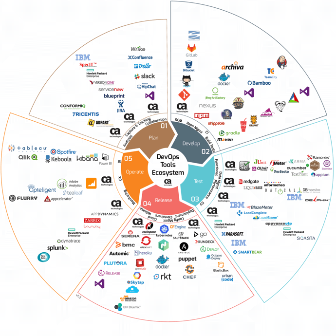

# 4.1 Introdução

Infraestrutura como Código \(do Inglês, _Infrastructure as Code_ - IaC\) refere-se a prática de configurar automaticamente a dependência de sistemas e de prover instâncias locais e remotas de tais sistemas \([Rahman et al., 2019](https://doi.org/10.1016/j.infsof.2018.12.004)\).

De forma simplificada, dada a importância da infraestrutura estar sempre operacional, não apenas para os usuários finais da aplicação mas para toda a equipe de desenvolvimento do produto de software, os scripts que garante a criação de contêineres e a coordenação entre os mesmos, deve ter qualidade semelhante ao do código da própria aplicação, daí o termo de Infraestrutura como Código. 

Entretanto, mesmo com toda essa importância, conforme destacado por [Rahman et al., \(2019\)](https://doi.org/10.1016/j.infsof.2018.12.004), ainda há muito o que avanças nessa área.

Rahman et al. \(2019\) conduziram uma mapeamento sistemático, visando a com compreender a partir da literatura, o estado atual sobre IaC. Ao final eles identificaram quatro tópicos principais: 1\) frameworks e ferramentas para IaC; 2\) uso de IaC; 3\) estudos experimentais relacionados a IaC; e 4\) teste em IaC. Concluíram com o estudo que existe uma vasta gama de trabalhos propondo ferramentas e frameworks para IaC. Entretanto, pesquisas no contexto de defeitos e falhas de segurança em IaC ainda estão apenas iniciando. Tais resultados são corroborados pelo estudo de [Guerreiro at al. \(2019\)](https://doi.org/10.1109/ICSME.2019.00092).  

[Guerreiro at al. \(2019\)](https://doi.org/10.1109/ICSME.2019.00092) investigaram o estado da prática sobre IaC por meio de entrevistas com pessoas técnicas que empregam IaC em suas empresas. Três pontos principais foram investigados: 1\) como a IaC é adotada na prática; 2\) que tipo de ferramenta de suporte existe e é utilizada, com suas vantagens e desvantagens; e 3\) qual a necessidade dos praticantes em relação ao desenvolvimento, manutenção e evolução IaC. Ao final da análise, concluíram que é fundamental a condução de mais estudos na área uma vez que o apoio oferecido pelas ferramentas existentes ainda é precário e limitado. Além disso, os desenvolvedores sentem necessidade de novas técnicas de teste e manutenção para código de IaC.

Desse modo, apesar de ser algo extremamente importante no cenário de desenvolvimento de software atual, as pesquisas em termos de técnicas e ferramentas de apoio, principalmente em relação a validação de scripts de IaC ainda é rudimentar e há muito o que ser feito.

De maneira geral, ainda não há uma tecnologia aceita como padrão, nem mesmo uma linguagem padrão para a escrita dos scripts de IaC, o que torna difícil, não apenas o desenvolvimento de ferramentas de qualidade, mas também a integração entre eles.

A quantidade de tecnologias que fazem parte do Ecossistema  DevOps é imensa. A figura abaixo, extraída de [Cohen \(2016\)](https://dzone.com/articles/the-ultimate-devops-tools-ecosystem-tutorial-part), dá uma visão geral da quantidade de tecnologias envolvida nesse cenário, dificultando até mesmo o aprendizado no tema. Entretanto, espera-se que com o amadurecimento da tecnologia, padrões passem a serem desenvolvidos ou algumas das tecnologias atuais se tornem padrões de fato e o cenário comece a mudar para a melhor.

Esse livro é baseado em Docker por ser essa uma tecnologia que se destaca nessa área de conteinerização. Entretanto, para que DevOps funcione de forma efetiva é necessário muito mais que contêineres. O gerenciamento dos mesmos, a orquestração entre eles, o monitoramento dos mesmos, dentre outras tarefas, são de fundamental importância para garantir a máxima automatização e a minimização de problemas decorrentes da intervenção humana no processo.

Em entrevista concedida a Yonas Beshawred \(2014\), [Jérôme Petazzoni](https://twitter.com/jpetazzo), Engenheiro Senior na Docker Inc., fala sobre a evolução do Docker e como ele se integra com ferramentas destinadas ao chamado gerenciamento de configuração de IaC, tais como [Chef,](https://www.chef.io/products/chef-infra/) [Puppet,](http://puppetlabs.com/) [Salt](http://www.saltstack.com/community/), ou [Ansible](http://www.ansible.com/home), por exemplo. Petazzoni foi claro em dizer que o Docker não seria um substituto dessas tecnologias e não havia interesse da Docker Inc em que ele se tornasse um substituto. 

Entretanto, o uso de gerenciadores de configuração para IaC fazem sentido quando há a necessidade de se gerenciar centenas de servidores ou contêineres. Nesses casos, passa a valer a pena estudar um desses gerenciadores de configuração e passar a fazer uso do mesmo para coordenar essa tarefa de provimento de servidores e coordenar a criação dos mesmos.

Para cenários de menor volume de contêineres, o [Docker Compose](https://docs.docker.com/compose/) é capaz de coordenar a criação dos contêineres de forma relativamente simples, como será apresentado a seguir. Combinando o Docker Compose com o Git, é possível orquestrar a criação dos contêineres e, ao mesmo tempo, manter o controle de versões dos arquivos e scripts responsáveis pela infraestrutura.

