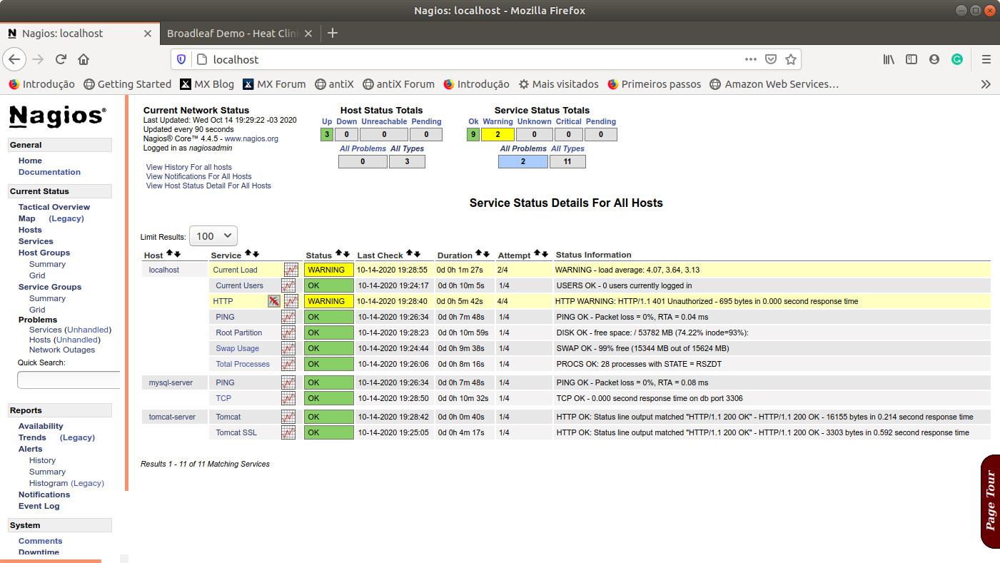

# 4.2 Orquestração com Docker Compose

Como o próprio nome diz, `docker-compose` é parte da pilha de tecnologias da Docker Inc e é responsável por definir e executar aplicações multi-contêineres com o `docker`.

Com ele, é possível definir uma aplicação multi-contêiner, coordenadanando a criação e a ordem de execução dos contêineres em um único arquivo, denominado `docker-compose.yml`. Com isso, passa a ser possível inicializar toda a aplicação a partir de um único comando, e não como fizemos até o momento, utilizando vários `docker run` de forma isolada e numa ordem gerenciada manualmente. 

No nosso caso, para inicializar a aplicação da loja virtual e a monitorá-la, precisamos, primeiramente, inicializar o Servidor de Banco de Dados, depois o Servidor Web e, por último, o Servidor de Monitoramento, pois existem uma dependência entre eles que precisa ser respeitada para que a aplicação execute com sucesso.

O `docker-compose` funciona como um orquestrador, ou seja, uma entidade que gerencia a criação das imagens na ordem determinada e de forma coordenada. Com base nos Dockerfile de imagens individuais, ele é capaz de coordenar a ordem de criação dos contêineres, além de outros recursos como o mapeamento de portas, gerenciamento de volumes, e até mesmo opções de reinicialização do contêiner em caso de alguma falha no mesmo.

A título de ilustração, considerando o nosso cenário, segue abaixo o arquivo de configuração da nossa loja virtual utilizando o `docker-compose` e as configurações que vimos até o momento de cada um dos contêineres de forma individualizada. Tais arquivos estão localizados na pasta `devops-extra/cap-04` do nosso repositório no GitHub \([https://github.com/aurimrv/devops-extra](https://github.com/aurimrv/devops-extra)\).

Após o `clone` do repositório, lembre-se de copiar o arquivo `devopsnapratica.war` para a pasta `devops-extra/cap-04/web`. Devido ao tamanho do arquivo ele não pode ser armazenado no GitHub, mas é referenciado no `Dockerfile` do Servidor Web.

[**Clique aqui para realizar o download do arquivo devopsnapratica.war**](https://drive.google.com/file/d/1xW9-hM0p6VxB4E5QduvWvEVbORA0j6Gc/view?usp=sharing)**.**

Com o repositório colonado e o arquivo devopsnapratica.war copiado, é possível seguir os passos abaixo. Primeiramente, vamos entender um pouco melhor o nosso arquivo `docker-compose.yml`.

```text
########################################################################
# Este arquivo docker-compose faz uso das imagens originais, 
# personalizadas por meio dos Dockerfile.
#
# Para inicializar os contêiners utilizando este aquivo, estando no 
# diretório no qual este arquivo se localiza, basta executar:
#
# docker-compose up
#
########################################################################
version: "3.3"
services:
  db:
    build: ./db
    restart: always
    ports:
      - "3306:3306"
    volumes:
      - ./data:/var/lib/mysql

  web:
    build: ./web
    restart: always
    ports:
      - "8080:8080"
    depends_on:
      - db

  monitor:
    build: ./monitor
    restart: always
    ports:
      - "80:80"
    depends_on:
      - web
      - db
```

Esse arquivo está localizado na raiz do diretório `devops-extra/cap-04` e é ele que irá coordenar a criação dos contêineres para "subir" nossa aplicação e o Servidor de Monitoramento.

Primeiramente, é importante observar que esse arquivo pode ter diferentes versões e, consequentemente, diferentes comandos podem ou não estar ativos em cada versão. No exemplo acima, estamos utilizando a versão `3.3` do arquivo `docker-compose.yml`. Ao tentar utilizar uma versão superior no arquivo de configuração acima, por exemplo, a versão `3.8`, o comando `docker-compose up` dá a mensagem abaixo:

```text
$ cd temp/devops-extra/cap-04
$ docker-compose up
ERROR: Version in "./docker-compose.yml" is unsupported. 
You might be seeing this error because you're using the wrong 
Compose file version. Either specify a supported version (e.g "2.2" or "3.3") 
and place your service definitions under the `services` key, or 
omit the `version` key and place your service definitions at the 
root of the file to use version 1.
For more on the Compose file format versions, 
see https://docs.docker.com/compose/compose-file/
```

Desse modo, optei pela utilização da versão `3.3` \(linha `11` do `docker-compose.yml`\), conforme indicado na mensagem de erro.

Em seguinda, na linha `12` do `docker-compose.yml` inicia-se a definição dos `services`, cada `service` corresponde a um ou mais contêineres que se deseja colocar em execução de forma coordenada. No nosso exemplo, existem três `services`: `db`\(linha 13\), `web`\(linha 21\), e `monitor`\(linha 29\), que correspondem, respectivamente, ao contêiner do Servidor de Banco de Dados, ao contêiner do Servidor Web, e ao contêiner do  Servidor de Monitoramento. Uma particularidade interessante é que, com o Docker Compose, o nome dos serviços, no caso, db, web e, monitor podem ser utilizados para a localização do contêiner, ou seja, ao invés de se utilizar o número IP para indicar o Servidor de Banco de Dados que o Servidor Web faz uso, não é necessário mais utilizar o IP, tornando a configuração mais genérica. 

Isso é possível porque o Docker Compose possui um _Domain Name Server_ \(DNS\) interno que faz o mapeamento do nome do serviço para o seu IP correspondente. Com isso, o arquivo `web/context.xml`, que era dependente do IP do Servidor de Banco de Dados pode ser alterado conforme abaixo:

```text
<?xml version='1.0' encoding='utf-8'?>
<Context>
  <WatchedResource>WEB-INF/web.xml</WatchedResource>

 	<Resource name="jdbc/web" auth="Container"
		type="javax.sql.DataSource" maxActive="100" maxIdle="30"
		maxWait="10000" username="loja" password="lojasecret"
		driverClassName="com.mysql.jdbc.Driver"
		url="jdbc:mysql://db:3306/loja_schema"/>

	<Resource name="jdbc/secure" auth="Container"
		type="javax.sql.DataSource" maxActive="100" maxIdle="30"
		maxWait="10000" username="loja" password="lojasecret"
		driverClassName="com.mysql.jdbc.Driver"
		url="jdbc:mysql://db:3306/loja_schema"/>

	<Resource name="jdbc/storage" auth="Container"
		type="javax.sql.DataSource" maxActive="100" maxIdle="30"
		maxWait="10000" username="loja" password="lojasecret"
		driverClassName="com.mysql.jdbc.Driver"
		url="jdbc:mysql://db:3306/loja_schema"/>
</Context>
```

Observa-se nas linhas `9`, `15` e `21`, o uso do nome db para fazer referência ao servidor de Banco de Dados, ao contrário do que apresentado anteriormente no qual fazíamos uso do número IP do servidor.

Da mesma forma, nos arquivos de configuração do Servidor de Monitoramento com o Nagios, monitor/lojacfg/loja\_virtual.cfg, na seção de Host Definition, o conteúdo agora ficou assim:

```text
...
###############################################################################
# HOST DEFINITION
###############################################################################
define host{
    use                 linux-server
    host_name           mysql-server
    alias               mysql-server
    address             db
    hostgroups          linux-servers
    check_command       check_mysql_database!loja!lojasecret!loja_schema
}

define host{
    use                 linux-server
    host_name           tomcat-server
    alias               tomcat-server
    address             web
    hostgroups          linux-servers
}
...
```

Observa-se que em `address` não usamos mais um IP fixo, mas sim, `db` e `web`, para referenciar os Servidores de Banco de Dados e Web, respectivamente.

Retornando ao arquivo docker-compose.yml, entre as linhas 13 a 19 define-se o contêiner responsável pelo Servidor de Banco de Dados.

A linha `13` define o nome do serviço `db`, na linha `14` indica-se que o serviço será construído a partir do diretório `./db`. Isso implica, indiretamente, que nesse diretório deve existir um `Dockerfile` responsável pela especificação da imagem e da personalização necessária para a criação do contêiner desejado. Na linha `15` \(`restart: always`\) especifica-se qual o comportamento do contêiner caso o mesmo enfrente algum problema de inicialização. No caso acima, optou-se por usar a opção `always`, que força o reinício caso qualquer coisa normal aconteça na inicialização do contêiner. 

Nas linhas `16` \(`ports:`\) e `17` \(`"3306:3306"`\) tem-se a possibilidade de redefinir a porta exporta pelo contêiner e permitir que o contêiner se torne visível externamente, no host.

Finalmente, nas linhas `18` e `19` criamos um volume conectando um diretório local do host `./data` com um diretório interno do contêiner \(`/var/lib/mysql`\). No caso, esse diretório do contêiner é o que armazena as configurações do banco de dados da apliucação e, memso após o encerramento do contêiner, os dados são copiados e permanessem disponíveis em `./data` para serem reaproveitados na próxima inicialização.

Em relação ao serviço referente ao Servidor Web, este está definido entre as linhas `21` a `27` do arquivo `docker-compose.yml`. A principal diferença apresentada é que este apresenta a cláusula `depends_on`, na linha `26`. Esta cláusula indica uma dependência entre os serviços e orienta o Docker Compose que o início do serviço `web` deve ocorrer após o início do serviço `db`. Já para o serviço `monitor`, a linha `34` indica que o mesmo depende do início dos serviços `db` e `web` e, portanto, será o último serviço a ser instanciado nessa configuração do Docker Compose.

Uma vez configurado o arquivo `docker-compose.yml`, estando no diretório raiz da localização dete arquivo, basta utilizar o comando `docker-compose up` para inicializar os serviços na ordem especificada e colocar a aplicação e o servidor de monitoramento no ar. 

```text
$ cd temp/devops-extra/cap-04/
$ docker-compose up
Creating cap04_db_1 ... 
Creating cap04_db_1 ... done
Creating cap04_web_1 ... 
Creating cap04_web_1 ... done
Creating cap04_monitor_1 ... 
Creating cap04_monitor_1 ... done
Attaching to cap04_db_1, cap04_web_1, cap04_monitor_1
db_1       | 2020-10-14 22:16:04+00:00 [Note] [Entrypoint]: Entrypoint script for MySQL Server 5.6.49-1debian9 started.
db_1       | 2020-10-14 22:16:05+00:00 [Note] [Entrypoint]: Switching to dedicated user 'mysql'
db_1       | 2020-10-14 22:16:06+00:00 [Note] [Entrypoint]: Entrypoint script for MySQL Server 5.6.49-1debian9 started.
db_1       | 2020-10-14 22:16:06+00:00 [Note] [Entrypoint]: Initializing database files
...
monitor_1  | Adding password for user nagiosadmin
monitor_1  | Started runsvdir, PID is 10
monitor_1  | checking permissions for nagios & nagiosgraph
monitor_1  | rsyslogd: [origin software="rsyslogd" swVersion="8.16.0" x-pid="18" x-info="http://www.rsyslog.com"] start
monitor_1  | postfix/master[16]: daemon started -- version 3.1.0, configuration /etc/postfix
...
web_1      | Oct 14, 2020 10:16:33 PM org.apache.catalina.startup.VersionLoggerListener log
web_1      | INFO: Server version name:   Apache Tomcat/7.0.105
web_1      | Oct 14, 2020 10:16:34 PM org.apache.catalina.startup.VersionLoggerListener log
web_1      | INFO: Server built:          Jul 2 2020 12:25:26 UTC
web_1      | Oct 14, 2020 10:16:34 PM org.apache.catalina.startup.VersionLoggerListener log
web_1      | INFO: Server version number: 7.0.105.0
...
```

Como é possível observar acima, o Docker Compose cria os serviços na ordem estabelecida pelas dependências em seu arquivo de configuração. Em seguida, dá-se início ao processamento completo de inicialização dos contêineres. Observa-se que o Docker Compose não aguarda o início completo de um serviço para iniciar o processamento do outro. Essas inicializações ocorrem em paralelo. Existem artifícios para impedir o processamento dos demais comando de inicialização do contêiner enquanto um serviço não esteja no ar por completo, entretanto, isso é contra a filosofia do Docker e das boas práticas de uso de sistemas multicontêineres. O ideal é que cada contêiner seja capaz de se auto gerenciar e aguardar que os demais estejam no ar para oferecer o seu serviço de forma transparente para o usuário.

No nosso exemplo, o servidor que demora mais a inicializar é o Servidor Web e, portanto, pode ocorrer que o Servidor de Monitoramento entre em atividade primeiro e acuse que o Servidor Web ainda não esteja operacional. Posteriormente, tudo se normalizará quando o Servidor Web conseguir carregar a aplicação da Loja Virtual.




Desse modo, como pudemos observar, foi possível concentrar a carga e a sequência desejada de início dos serviços em um único arquivo de configuração, facilitando a realização do deploy da aplicação no ambiente de produção. 

Para verificar se os serviços estão em execução, podemos utilizar o comando docker ps, conforme ilustrado abaixo:

```text
$ docker ps
CONTAINER ID        IMAGE               COMMAND                  CREATED             STATUS              PORTS                    NAMES
f9e73b7c431b        cap04_monitor       "/usr/local/bin/star…"   19 minutes ago      Up 18 minutes       0.0.0.0:80->80/tcp       cap04_monitor_1
500f2bcaff46        cap04_web           "catalina.sh run"        19 minutes ago      Up 18 minutes       0.0.0.0:8080->8080/tcp   cap04_web_1
f71bab817485        cap04_db            "docker-entrypoint.s…"   19 minutes ago      Up 19 minutes       0.0.0.0:3306->3306/tcp   cap04_db_1
```

Como é possível observar, ao final do processo, existem três contêineres em execução, decorrentes da execução do comando docker-compose up. Se necessário parar a execução dos serviços, basta executar o comando docker-compose stop, conforme ilustrado abaixo.

```text
$ docker-compose stop
Stopping cap04_monitor_1 ... done
Stopping cap04_web_1     ... done
Stopping cap04_db_1      ... done
```

Observa-se que na parada dos serviços, o Docker Compose respeita a dependência e pára os serviços em ordem inversa da inicialização.

No próximo capítulo abordaremos o processo de integração contínua e entrega contínua que estão relacionadas ao ambiente de desenvolvimento e, posteriormente, de atualização do ambiente de produção se tudo correr conforme o esperado.

