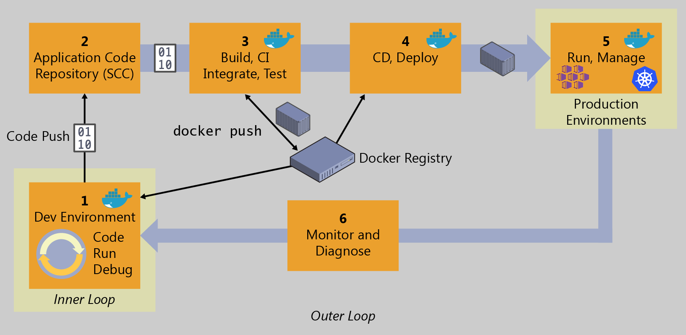

# 5.1 Introdução

Nós capítulos anteriores o foco foi na demonstração da implantação do ambiente de produção considerando a tecnologia Docker. Desse modo, demonstramos como usar contêineres para colocar no ar uma aplicação funcional. Basicamente fizemos uso de três servidores para isso: um Servidor de Banco de Dados \(MySQL\), um Servidor de Aplicação \(Tomcat\), e um Servidor de Monitoramento \(Nagios\).

Observa-se que, para isso, não falamos sobre o processo de construção do arquivo `lojavirtualdevops.war` que foi utilizado para se efetuar o _deploy_ no Servidor de Aplicação.

Neste capítulo e no próximo abordaremos especificamente a questão da construção do arquivo `lojavirtualdevops.war` , em outras palavras, retomando a figura abaixo, apresentada anteriormente no Capítulo 1.2, atacaremos as etapas 1, 3 e 4. O foco será no uso de Docker e outras tecnologias nas etapas de Desenvolvimento e Integração Contínua \(_Continuous Integration_\) \(Capítulo 5\) e Entrega Contínua \(_Continuous Deployment_\) \(Capítulo 6\).

Conforme ressalta [Sato \(2018](https://www.casadocodigo.com.br/products/livro-devops)\), a essência do DevOps é exatamente a cooperação entre as equipes de desenvolvimento e operações em prol de construir e disponibilizar uma aplicação de qualidade para os usuários finais utilizando o máximo possível de automatização nesse processo. Para isso, escrever código para a aplicação e para a infraestrutura é fundamental.

Considerando essa forma moderna de desenvolvimento de software o que se pretende é que, a cada alteração realizada no código da aplicação que seja confirmada \(_commit_\), siga-se um fluxo \(_pipeline_\) que permita a compilação, teste e geração do pacote da aplicação para entrega ao ambiente de produção se for o caso.

Espero que estejam animados para essas últimas etapas de aprendizado.

