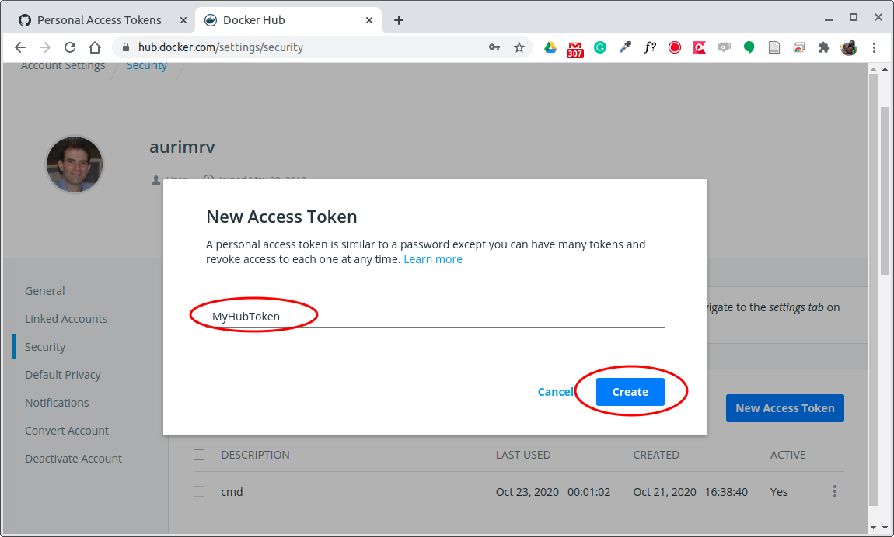

# 5.4 Garantindo Acesso de Desenvolvedor nas Plataformas por meio de Tokens

Para ilustrar o processo de integração contínua será utilizado o GitLab CI/CD. O GitLab poderia ser utilizado por si só uma vez que tem funções semelhantes as do GitHub mas possui um processo de CI/CD mais maduro que o do GitHub. Como usamos o GitHub até o momento e ambas as ferramentas podem ser integradas de modo a manter duas cópias dos repositórios sincronizadas, a seguir apresentamos esse processo de configuração.

### Geração de tokens de acesso para desenvolvimento

As três plataformas que faremos uso para implementar nosso processo de CI/CD são bastante semelhantes no aspecto de autenticação para uso dos serviços oferecidos. Par se conectar nessas plataformas e realizar operações, GitHub, GitLab e Hub Docker, além de outras, optam pelo uso de um token de acesso e não do login e senha tradicionais, principalmente se você habilitar o processo de autenticação em duas etapas, que seria o recomendado.

Para a execução dos passos a seguir assume-se que já temos uma conta cadastrada em cada uma das plataformas que faremos uso: [GitHub](https://github.com/), [GitLab](https://gitlab.com) e [Hub Docker](https://hub.docker.com/). Se esse não é o seu caso, antes de prosseguir, certifique-se que você já criou a sua conta de acesso normal a cada um desses ambientes.

#### Token de acesso ao GitHub

Para a criação do token de acesso ao desenvolvedor do GitHub, siga os passos ilustrados na sequência de figuras apresentadas a seguir.

1 - Logar em sua conta no GitHub

2 - Entrar nas configurações da conta

3 - Escolher a opção de Configurações de Desenvolvedor

4 - Escolha a opção de Token de Acesso Pessoal

5 - Atribua um nome qualquer ao token, selecione as permissões desejadas e solicite a geração do token

6 - Copie e cole o valor do token para uso futuro. Os números do token só ficarão visíveis nesse momento. É importante salvar esse token em um arquivo texto para uso futuro, na sequência do capítulo.

No decorrer do texto, toda vez que formos utilizar esse token vamos nos referir a ele como **`GITHUB_TOKEN`**.

#### Token de acesso ao GitLab

Faremos um processo semelhante na plataforma do GitLab. A sequência de telas a seguir ilustrará o processo para a geração do token no GitLab.

1 - Estando autenticado na plataforma do GitLab, entrar nas configurações da conta

2 - Escolha a opção de Token de Acesso

3 - Atribua um nome qualquer ao token, selecione as permissões desejadas e solicite a geração do token

4 - Copie e cole o valor do token para uso futuro. Os números do token só ficarão visíveis nesse momento. É importante salvar esse token em um arquivo texto para uso futuro, na sequência do capítulo

No decorrer do texto, toda vez que formos utilizar esse token vamos nos referir a ele como **`GITLAB_TOKEN`**.

#### Token de acesso ao Hub Docker

Faremos um processo semelhante na plataforma do Hub Doker. A sequência de telas a seguir ilustrará o processo para a geração do token na referida plataforma.

1 - Estando autenticado na plataforma do Hub Docker, entrar nas configurações da conta

2 - Escolha a opção de Segurança e , em seguida, Novo Token de Acesso

3 - Atribua um nome ao token e solicite a geração

4 - Copie e cole o valor do token para uso futuro. Os números do token só ficarão visíveis nesse momento. É importante salvar esse token em um arquivo texto para uso futuro, na sequência do capítulo

No decorrer do texto, toda vez que formos utilizar esse token vamos nos referir a ele como **`DOCKER_TOKEN`**.

