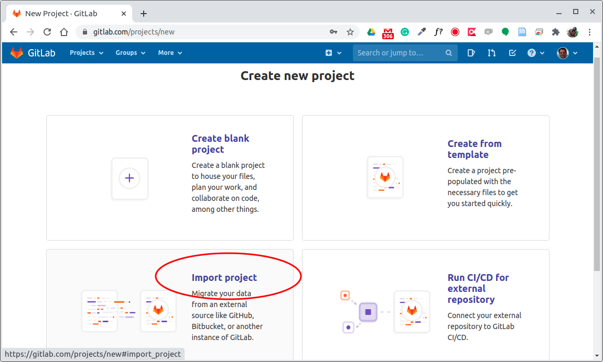
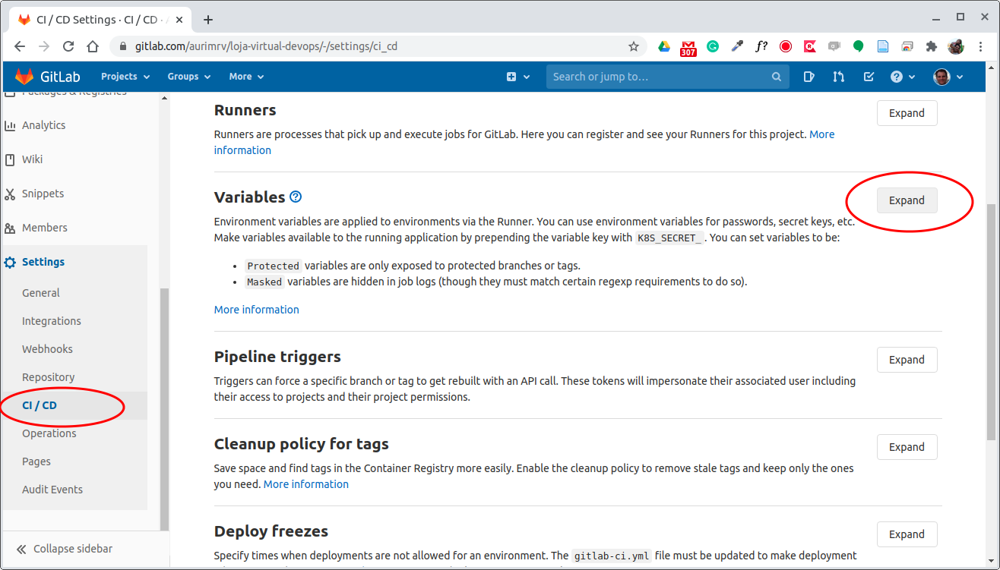

# 5.5 Integrando GitLab e GitHub

Uma vez gerados os tokens de acesso de desenvolvedor, é possível agora da início à integração de ambas as plataformas. A intenção aqui é, importar o projeto exemplo da Loja Virtual atualmente hospedado no GitHub e configurar o GitLab de modo que os repositórios passem a ser espelhados.

Após isso, vamos ilustrar o pipeline de Integração Contínua que é executado a cada novo _commit_ da aplicação.

O primeiro passo a ser realizado é a importação do projeto do GitHub para o GitLab. Para isso, se ainda não foi feito, é necessário que você entre na plataforma do GitHub com sua conta, localize o projeto da loja virtual disponível no endereço [https://github.com/aurimrv/loja-virtual-devops](https://github.com/aurimrv/loja-virtual-devops) e faça um fork deste projeto.

### Importação do Projeto Exemplo

Em seguida, faça o login em sua conta da plataforma GitLab e siga os passos a seguir. Primeiramente, seleciona a opção de Projetos e, em seguida, selecione a opção para a criação de um novo projeto.

No nosso caso, iremos importar um projeto do GitHub, conforme mostram as figuras a seguir.

Feita essa seleço, ser exibida uma lista de projetos que podem ser importadas. Se você realizou o _fork_ do projeto original que está em minha conta do GitHub para a sua, nessa lista deve aparecer o projeto `loja-virtual-devops` precedido de seu nome de usuário e no de `aurimrv` como no exemplo. Localize esse projeto e escolha a opção de importar, seguindo os passos para finalizar essa operação.

Se tudo correr bem, ao final, você deve ver o projeto em sua lista de projetos, conforme ilustrado a seguir.

### Integração do GitLab com GitHub

Nos próximos passos iremos integrar o GitLab com o GitHub. Para isso, faremos uso do `GITHUB_TOKEN`, gerado anteriormente. A integração se dá conforme ilustrado a seguir.

Selecione o projeto que deseja realizar a integração e entre no menu lateral na opção Configurações-&gt;Integrações. 

Observa-se que o GitLab pode ser integrado a uma diversidade de ambientes. Navegue na lista até encontrar o GitHub e selecione essa opção.

Na janela que se abre  necessário fazer uso do token de acesso pessoal do GitHub que foi gerado anteriormente \(`GITHUB_TOKEN`\). Copie o valor do token e cole no campo indicado \(1\). Observa-se que você deve também alterar a URL para refletir a localização correta do projeto da `loja-virtual-devops` na sua área do GitHub \(2\).  Após colar o token é importante solicitar o teste da conexão \(3\). Se tudo correr bem, com o teste da conexão bem sucedido, basta salvar a configuração da integração realizada.

Observa-se que o próprio GitLab informa, na tela acima, que a integração com o GitHub exige que seja configurado o espelhamento do repositório no GitHub e isso é o que será feito em sequência.

### Espelhamento do Repositório do GitHub

O espelhamento permite que o repositório do GitLab e do GitHub permaneçam com as mesma informações em caso de mudança. É possível espelhar o repositório em uma direção ou em ambas, ou seja, qualquer alteração no repositório do projeto no GitHub é refletida dentro do repositório do projeto no GitLab e/ou vice-versa.

Considere a figura abaixo. Para configurar o espelhamento também será necessário fornecer o e a URL para acesso ao repositório \(1\). No meu caso, a URL foi ligeiramente diferente daquela mostrada na tela da integração acima. Ela tem o seguinte formato: 

`https://<seu_github_username>@github.com/<seu_github_group>/<seu_github_project>.git`

No meu caso, essa URL ficou assim:

`https://aurimrv@github.com/aurimrv/loja-virtual-devops.git`

Para mais informações sobre essa integração, é possível consultar a documentação oficial do GitLab, disponível nesse endereço: [https://docs.gitlab.com/ee/user/project/repository/repository\_mirroring.html](https://docs.gitlab.com/ee/user/project/repository/repository_mirroring.html).

No exemplo acima o espelhamento foi configurado apenas no sentido do GitLab para o GitHub, ou seja, na terminologia do Git, utilizando-se um `push` do repositório do GitLab para o repositório do GitHub \(2\). Desse modo, as alterações realizadas dentro do repositório do GitLab são copiadas para o repositório do GitHub após serem confirmadas por meio de um _commit_.

O campo senha \(3\) deve ser preenchido com o valor do `GITHUB_TOKEN`. Por fim, basta finalizar clicando em Espelhar Repositório \(4\).

Caso deseje forçar o espelhamento, basta clicar no ícone mostrado na tela abaixo. Do contrário, o espelhamento irá ocorrer periodicamente.

### Criando Variáveis para Uso no Processo de CI/CD

A última etapa que devemos configurar para que possamos dar início à implementação do pipeline CI/CD é a definição de variáveis que serão utilizadas dentro do nosso fluxo. Para evitar a exposição de dados sigilosos dentro de nosso script de integração contínua ou de entrega contínua, o GitLab permite a definição de pares, \(chave, valor\) de modo que, dentro dos scripts, podemos simplesmente utilizar as chaves como uma variável e, durante a execução dos mesmos, essas chaves são substituídas pelos seus valores correspondentes.

Para o script que iremos desenvolver a seguir iremos precisar do nome do usuário e do token de acesso para a plataforma do Hub Docker. Optamos por colocar essas informações nessa seção de variáveis oferecida pelo GitLab. Toda vez que se desejar ocultar informações em nossos scripts, esse recurso pode ser utilizado.

Para isso, no menu de configuração do projeto, vamos selecionar a opção CI/CD. 

O processo de criação de uma variável é simples. Basta clicar em Adicionar Variável e fornecer um par de informações, ou seja, uma chave e um valor. No exemplo a seguir, foram definidas duas chaves, uma denominada **DOCKER\_ID**, que contém o valor do nome do usuário na plataforma do Hub Docker; e a outra denominada **DOCKER\_TOKEN**, que contém o valor do `DOCKER_TOKEN` criado anteriormente.

