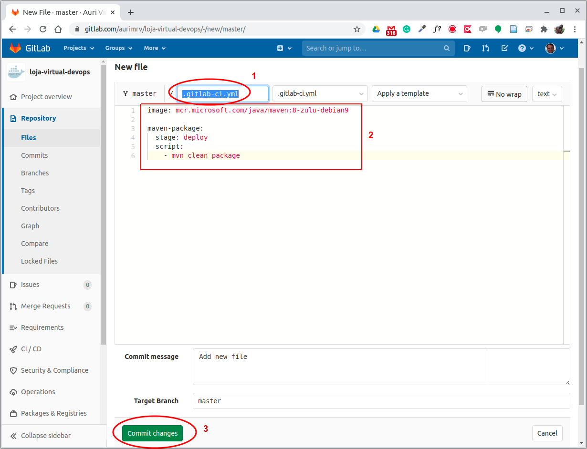
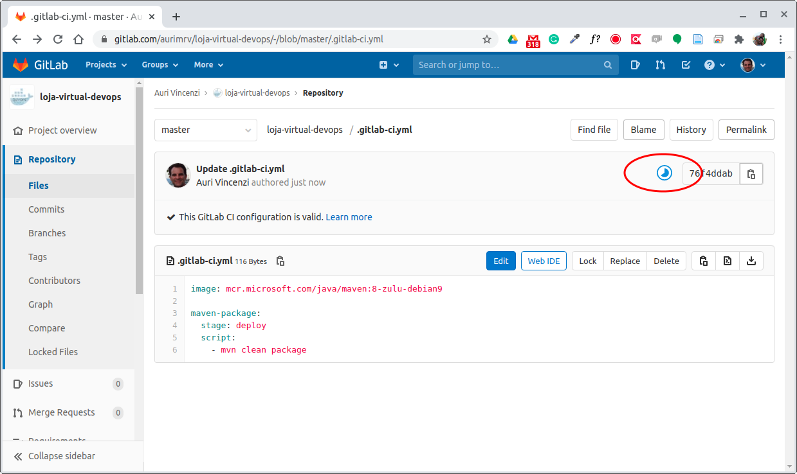
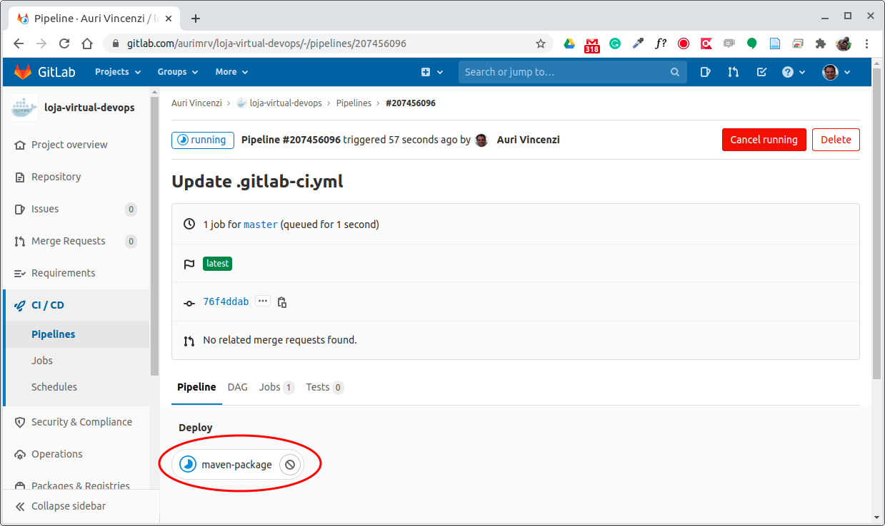
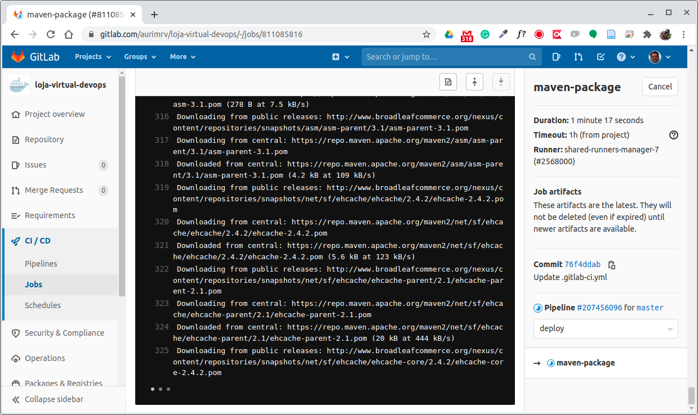
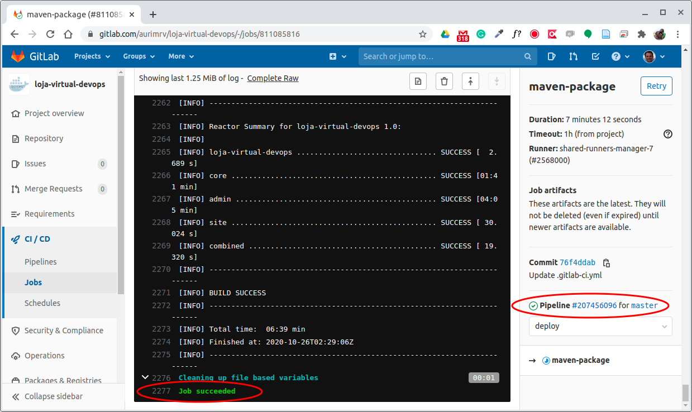
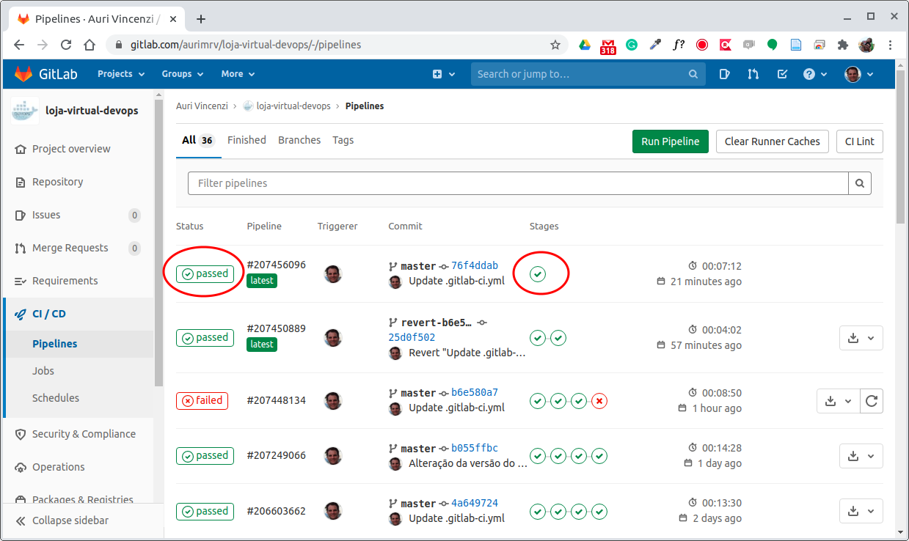
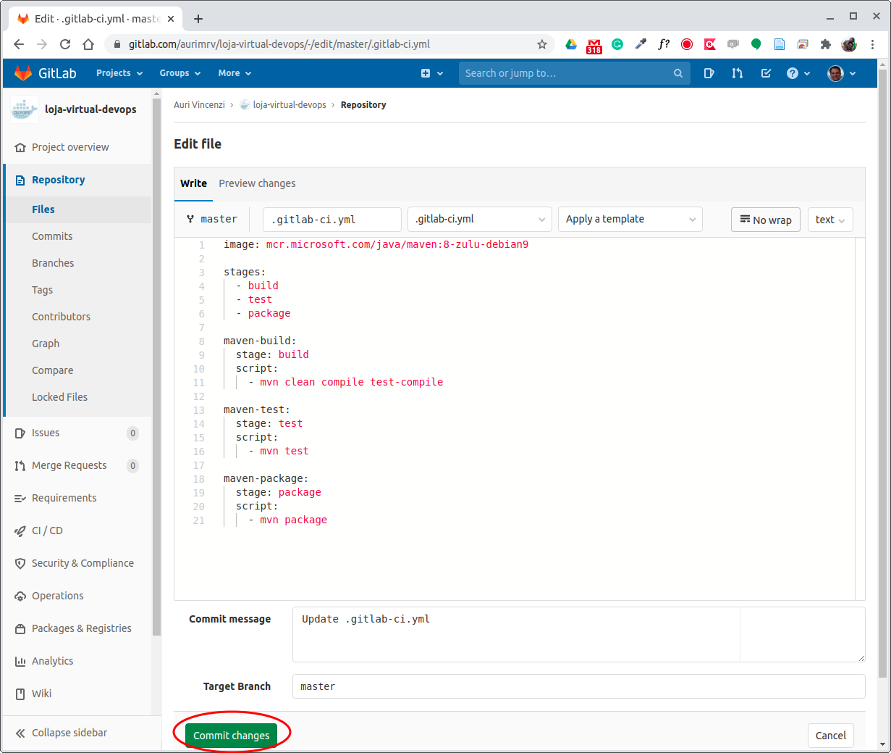
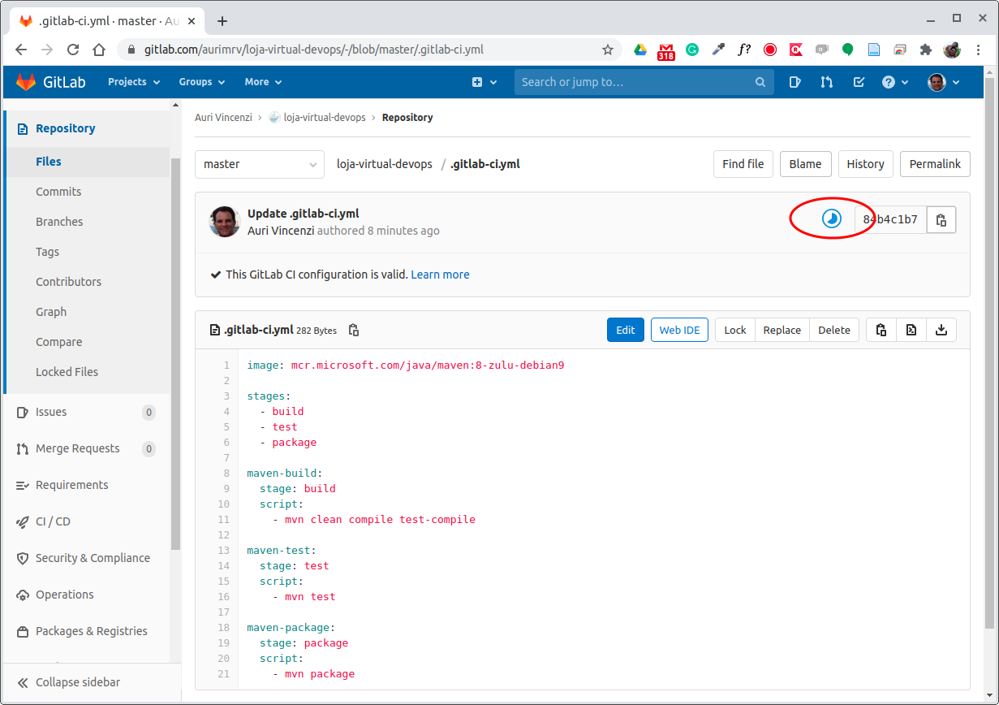
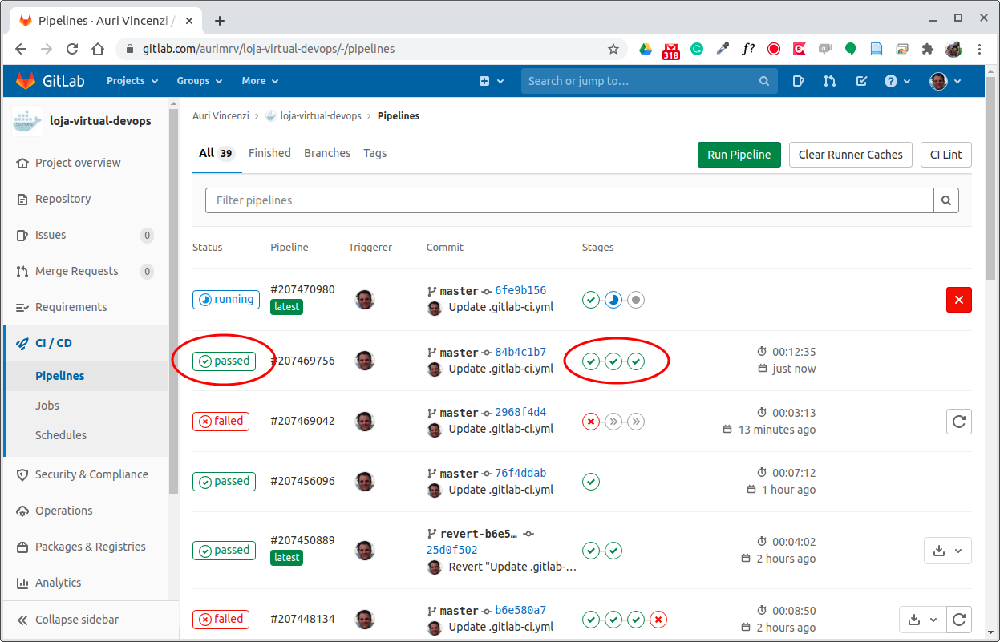

# 5.6 Pipeline de Integração Contínua com GitLab CI/CD

Finalmente chegamos no ponto de criarmos nosso primeiro script que irá possibilitar a realização da chamada Integração Contínua.

De maneira geral, a grande maioria das ferramentas possuem um processo semelhante ao do GitLab CI/CD. Algumas, como o [Jenkins](https://www.jenkins.io/), oferecem uma interface gráfica para a configuração do pipeline de Integração Contínua, outras, como o GitLab CI/CD, permitem a definição desse pipeline por meio de um arquivo especial, localizado no diretório do projeto. 

No caso do GitLab CI/CD o pipeline é definido dentro de um arquivo denominado ****`.gitlab-ci.yml` , que segue o formato do [YAML](https://yaml.org/), que nada mais é do que uma linguagem de marcação. Este arquivo define a ordem em que se dará a execução do pipeline. 

Uma explicação detalhada da estrutura e organização do arquivo `.gitlab-ci.yml` pode ser encontrada em: [https://docs.gitlab.com/ee/ci/yaml/](https://docs.gitlab.com/ee/ci/yaml/). Abaixo apresentamos os conceitos essenciais para a compreensão do pipeline que desejamos para a construção da nossa aplicação de forma automática e posterior entrega da mesma no ambiente de produção.

### Jobs

Um arquivo  `.gitlab-ci.yml` é formado, basicamente, por um conjunto de _jobs_, na terminologia do GitLab CI/CD. _Jobs_ são os elementos mais básicos dentro do arquivo `.gitlab-ci.yml`.

Conforme a documentação oficial, _jobs são:_

* Definido com restrições informando em que condições devem ser executad_os;_
* Elementos de nível superior com um nome arbitrário e que devem conter pelo menos a cláusula `script`. 
* Ilimitados dentro de um arquivo `.gitlab-ci.yml`.

```text
job1:
  script: "execute-script-for-job1"

job2:
  script: "execute-script-for-job2"
```

O exemplo acima ilustra uma simples configuração de CI/CD com dois _jobs_ distintos. Cada um executa um comando diferente, especificado nas cláusulas `script`. Um comando pode executar código diretamente \(`./configure;make;make install`\) ou executar um script \(`test.sh`\) no repositório.

Os jobs são executados por [runners \(executores\)](https://docs.gitlab.com/ee/ci/runners/README.html) em um ambiente exclusivo dentro do executor. Além disso, vale ressaltar que os jobs executam de forma independente uns dos outros.

Embora cada job deva ter um nome, existem algumas **palavras chaves reservadas** e, portanto, não é possível atribuir algum desses nomes para um job. São elas:

* `image`
* `services`
* `stages`
* `types`
* `before_script`
* `after_script`
* `variables`
* `cache`
* `include`

Além disso, um job é definido internamente por uma lista de palavras chaves. Cada uma define um comportamento diferente dentro do job. A seguir são apresentadas algumas delas, as que serão necessárias para compreender o que será apresentado a seguir. Para uma explicação detalhada e conhecimento das demais cláusulas permitidas dentro de um job recomenda-se a leitura da documentação oficial em [https://docs.gitlab.com/ee/ci/yaml/](https://docs.gitlab.com/ee/ci/yaml/).

Lista de algumas palavras chaves \(_keywords_\) que definem comportamentos no job:

| Keyword | Descrição |
| :--- | :--- |
| [`script`](https://docs.gitlab.com/ee/ci/yaml/#script) | Determina o comando ou script que será executado pelo runner. |
| [`after_script`](https://docs.gitlab.com/ee/ci/yaml/#before_script-and-after_script) | Permite a execução de um conjunto de comandos após a execução do job ser finalizada. |
| [`artifacts`](https://docs.gitlab.com/ee/ci/yaml/#artifacts) | Lista de arquivos ou diretórios anexados ao job quando sua execução finaliza com sucesso. Tais artefatos ficam disponíveis para download na plataforma. Veja também: `artifacts:paths`, `artifacts:exclude`, `artifacts:expose_as`, `artifacts:name`, `artifacts:untracked`, `artifacts:when`, `artifacts:expire_in`, e `artifacts:reports`. |
| [`before_script`](https://docs.gitlab.com/ee/ci/yaml/#before_script-and-after_script) | Permite a execução de um conjunto de comandos antes da execução do job. |
| [`cache`](https://docs.gitlab.com/ee/ci/yaml/#cache) | Lista de arquivos que devem ser mantidos em cache entre execuções subsequentes. Veja também: `cache:paths`, `cache:key`, `cache:untracked`, `cache:when`, e `cache:policy`. |
| [`image`](https://docs.gitlab.com/ee/ci/yaml/#image) | Uso de imagens Docker. Veja também: `image:name` e `image:entrypoint`. |
| [`only`](https://docs.gitlab.com/ee/ci/yaml/#onlyexcept-basic) | Limita quando os jobs podem ser criados: `only:refs`, `only:kubernetes`, `only:variables`, e `only:changes`. |
| [`services`](https://docs.gitlab.com/ee/ci/yaml/#services) | Uso de serviços de imagens Docker. Veja também: `services:name`, `services:alias`, `services:entrypoint`, e `services:command`. |
| [`stage`](https://docs.gitlab.com/ee/ci/yaml/#stage) | Define o stage \(estágio\) de um job \(padrão: `test`\). |
| [`variables`](https://docs.gitlab.com/ee/ci/yaml/#variables) | Define variáveis no nível do job. |

### Primeiro job no projeto exemplo

Para exemplificar os conceitos acima vamos dar início à definição do pipeline DevOps no projeto exemplo da Loja Virtual. O primeiro passo para isso é criarmos o arquivo `.gitlab-ci.yml` dentro do GitLab conforme sequência de telas a seguir. Basicamente, estando no repositório do projeto **loja-virtual-devops**, basta clicar no sinal de "+" e escolher a opção de Novo Arquivo.


Em seguida, basta atribuir um nome \(1\), digitar o conteúdo do arquivo \(2\) e confirmar as alterações \(3\). Trata-se de um arquivo com um único job, denominado `maven-package`.  Esse script de Integração Contínua faz uso da imagem `mcr.microsoft.com/java/maven:8-zulu-debian9`, para construir nossa aplicação exemplo da loja virtual, conforme ilustrado na Seção 5.3. Por padrão, as imagens são baixadas do Hub Docker mas é possível alterar essa configuração se desejado. Para mais informações sobre como alterar o repositório de contêineres consulte [https://docs.gitlab.com/ee/user/packages/container\_registry/](https://docs.gitlab.com/ee/user/packages/container_registry/). Em nosso caso, faremos uso do Hub Docker padrão para a busca e registro de imagens. 

Dentro dessa imagem existe uma instalação do Maven e, portanto, o comando `mvn clear package`, dentro da cláusula `script` do job, será executado pelo _runner_ sem problemas. O último detalhe é que esse job foi associado ao `stage` `deploy`. Se fosse omitida essa cláusula, ele estaria associado, por padrão, ao `stage` `test`, conforme documentado acima. Falaremos mais sobre `stages` a seguir.

```text
image: mcr.microsoft.com/java/maven:8-zulu-debian9

maven-package:
  stage: deploy
  script:
    - mvn clean package
```



Observe que assim que confirmar as alterações, o GitLab detecta que criamos um arquivo de integração contínua e dá início a execução do mesmo, conforme ilustrado na figura abaixo por meio do círculo azul semi completo. 



Ao clicar sobre esse círculo destacado na figura acima é possível consultar o andamento das atividades em execução no pipeline. No exemplo abaixo é possível ver que o job `maven-package`, associado ao `stage` Deploy, está em execução. Nessa tela, no canto superior, é possível também verificar que é possível cancelar ou apagar a execução desse pipeline.



Um clique sobre o nome do job permite visualizar o status de sua execução e acompanhar o passo a passo do script que está executando, no caso, o `mvn clean package`.



Ao terminar da execução, o job encerrando com sucesso, define que o pipeline aprovou último _commit_ realizado. Se houver falha na execução do script, o job é reprovado e, consequentemente, o pipeline acusa uma falha.





### Detalhando o Pipeline de Integração Contínua

Como observamos acima, criamos um pipeline de CI com apenas um job que, ao final, em caso de sucesso, gera o arquivo `lojavirtualdevops.war`. Entretanto, em geral, o processo de construção de uma aplicação passa por diferentes estágios, até que a mesma seja finalmente empacotada para a distribuição. 

O próprio construtor da aplicação que utilizamos, o Maven, possui vários objetivos que são executados um a um até que o arquivo .war final seja produzido. Desse modo, é possível então detalhar o pipeline CI para que possamos observar mais detalhadamente o que acontece em cada um desses estágios da construção da aplicação. 

O GitLab permite que isso seja feito por meio da definição de estágios \(`stages`\) dentro de nosso arquivo de configuração.

Mas o que são os `stages`?

`stages` são usados para definir etapas que contém jobs associados. Os `stages` são definidos de forma global para o pipeline.

Com a especificação de `stages` passamos a ter pipelines multiestágios, e não de estágio único como no exemplo anterior no qual tinhamos apenas o estágio Deploy. A ordem dos elementos dentro de `stages` define a ordem em que os jobs serão executados:

1. Jobs dentro do mesmo `stage` são executados em paralelo;
2. Jobs do próximo `stage` só iniciam sua execução após todos os jobs de um `stage` anterior finalizarem com sucesso.

Desse modo, vamos considerar a alteração abaixo em nosso arquivo de configuração do pipeline:

```text
image: mcr.microsoft.com/java/maven:8-zulu-debian9

stages:
  - build
  - test
  - package

maven-build:
  stage: build
  script: 
    - mvn clean compile test-compile

maven-test:
  stage: test
  script: 
    - mvn test

maven-package:
  stage: package
  script: 
    - mvn package
```

Na linha 3 fazemos uso de `stages` e definimos três estágios: `build`, `test`, e `package`. Cada um deles está diretamente relacionado a um job que executa uma tarefa do Maven.

O comportamento definido para a execução de cada job passa a ser o seguinte:

1. Primeiro, todos os jobs de `build` são executados em paralelo;
2. Se todos os jobs de `build` finalizarem com sucesso, os jobs de `test` iniciam a execução em paralelo.
3. Se todos os jobs de `test` finalizarem com sucesso, os jobs de `package` iniciam a execução em paralelo.
4. Se todos os jobs de `package` finalizarem com sucesso, o _commit_ é marcado como `passed`; e
5. Se algum dos jobs anteriores falhar, o _commit_ é marcado como `failed` e nenhum job subsequente é executado.

Há ainda duas particularidades com `stages`:

1. Se não há uma definição global de `stages` no arquivo `.gitlab-ci.yml`, então, os estágios `build`, `test` e `deploy` podem ser utilizados nos jobs por padrão;
2. Se um job não especificar a qual `stage`,  ele é associado ao estágio `test` por padrão.

Para verificar se a alteração acima funciona corretamente, basta editarmos nosso arquivo `.gitlab-ci.yml` e, ao confirmar essa mudança, o pipeline entra em execução, conforme ilustrado a seguir.






Ao clicar sobre o círculo azul, é possível acompanhar a execução de cada job, associado a cada estágio do pipeline. Se desejar ter informações detalhadas sobre a saída produzida pelos scripts em execução em cada job, basta clicar sobre o nome do respectivo job e são exibidos detalhes do processo encerrado ou em andamento.


No exemplo acima, todos os estágios finalizaram com sucesso de modo que o pipeline foi aprovado.



Dessa forma, de maneira geral, pode-se dizer que o processo para a criação de pipelines com o GitLab CI/CD não é uma tarefa muito complicada mas exige que se conheça a documentação de como escrever corretamente o arquivo de configuração do pipeline. 

Existem muitas outras opções que podem ser utilizadas e exploraremos mais algumas delas no capítulo a seguir, mas recomendo fortemente que, aqueles interessados em fazer uso profissional da tecnologia, leiam atentamente toda a documentação da mesma para compreender suas capacidades e limitações.

