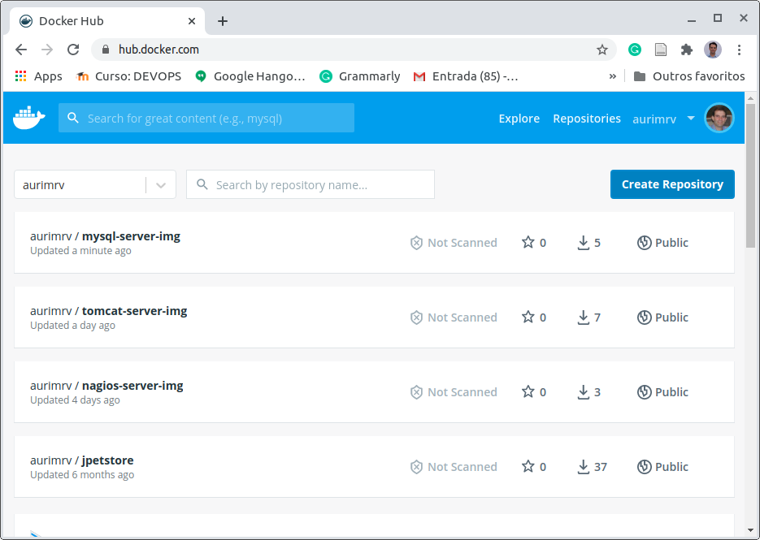

# 6.2 Personalizando Imagem Docker

Nos capítulos anteriores, utilizamos imagens do Hub Docker e as personalizamos para atender nossas necessidades de configuração de Servidor de Banco de Dados e Servidor de Aplicação e Servidor de Monitoramento. 

Uma vez que temos um arquivo Dockerfile contento essa alteração, o mesmo Dockerfile pode ser utilizado para a construção de uma imagem personalizada e já fizemos isso em capítulo anteriores utilizando-se o comando docker build. Entretanto, a imagem personalizada foi mantida apenas localmente e não disponibilizada para uso geral. Para darmos mais esse passo precisamos, primeiro, ter nossa conta no Hub Docker e criar o nosso `DOCKER_TOKEN`, conforme descrito na Seção 5.4 do Capítulo 5. Os passos a seguir assumem que essa tarefa já foi feita e, portanto, podemos agora enviar as imagems geradas localmente para nossas respectivas contas no Hub Docker de modo que, posteriormente, podemos simplificar o nosso arquivo do docker-compose para que passa a utilizar essas nossas imagens.

Para realizar esse processo, estão disponibilizados no nosso GitHub a versão mais atual dos aquivos do [devops-extra,](https://github.com/aurimrv/devops-extra) incluindo esses arquivos referentes ao Capítulo 6. Para download basta clonar ou atualizar seu repositório local com os dados de [https://github.com/aurimrv/devops-extra](https://github.com/aurimrv/devops-extra).

Dentro da pasta devops-extra/cap-06 estão os subdiretórios com os arquivos Dockerfile personalizando os servidores Web e de Monitoramento. A título de ilustração, abaixo está o Dockerfile do Servidor de Banco de Dados.

```text
$ cd ~/temp/devops-extra/cap-06/db/
$ ls -l
total 8
-rw-r--r-- 1 auri auri 245 out 22 14:50 Dockerfile
-rw-r--r-- 1 auri auri  40 out 22 14:50 schema.sql
```

```text
FROM mysql:5.6

LABEL maintainer="auri@ufscar.br, g4briel.4lves@gmail.com"

ENV MYSQL_ROOT_PASSWORD secret
ENV MYSQL_DATABASE loja_schema
ENV MYSQL_USER loja
ENV MYSQL_PASSWORD=lojasecret

COPY schema.sql /docker-entrypoint-initdb.d

EXPOSE 3306
```

Para construir essa imagem personalizada para uso local, utilizamos o comando abaixo:

```text
$ docker build -t mysql-server-img .
```

Entretanto, como desejamos que essa imagem possa ser complartilhada via Hub Docker, inicialmente, precisamos mudar o seu nome de modo a incluir, precendendo o mesmo, o `DOCKER_ID` do usuário Docker do Hub Docker que foi criado. No meu caso, esse `DOCKER_ID` é `aurimrv`. Desse modo, o comando de construção a ser utilizado será:

```text
$ docker build -t aurimrv/mysql-server-img .

Sending build context to Docker daemon  3.072kB
Step 1/8 : FROM mysql:5.6
 ---> 44241dbd4d38
Step 2/8 : LABEL maintainer="auri@ufscar.br, g4briel.4lves@gmail.com"
 ---> Using cache
 ---> f067af2f298c
Step 3/8 : ENV MYSQL_ROOT_PASSWORD secret
 ---> Using cache
 ---> 3ccc75d5cc19
Step 4/8 : ENV MYSQL_DATABASE loja_schema
 ---> Using cache
 ---> e366aa3b7dbe
Step 5/8 : ENV MYSQL_USER loja
 ---> Using cache
 ---> 9dc9f3916976
Step 6/8 : ENV MYSQL_PASSWORD=lojasecret
 ---> Using cache
 ---> d0e63e3fd332
Step 7/8 : COPY schema.sql /docker-entrypoint-initdb.d
 ---> Using cache
 ---> 3850f356adb2
Step 8/8 : EXPOSE 3306
 ---> Using cache
 ---> 01d6b189721e
Successfully built 01d6b189721e
Successfully tagged aurimrv/mysql-server-img:latest

```

Ao final desse processo temos uma imagem denominada aurimrv/mysql-server-img, criada e armazenada localmente. Agora vamos enviá-la para o Hub Docker. Para isso você precisa saber o seu `DOCKER_ID` e o seu `DOCKER_TOKEN`. Ambos serão utilizados no processo. Ao ser solicitada a Password, simplesmente copie e cole o seu token de acesso de desenvolvedor na platadorma Hub Docker.

```text
$ docker login -u aurimrv
Password: 
Login Succeeded
```

Após o login realizado com sucesso agora basta enviar a imagem para sua área do Hub Docker. Isso é feito de forma semelhante a atualização via Git, por meio de um comando `docker push`, conforme ilistrado abaixo.

```text
$ docker push aurimrv/mysql-server-img

The push refers to repository [docker.io/aurimrv/mysql-server-img]
9d2d73c1545d: Layer already exists 
5b1a817757f0: Layer already exists 
e201e7ba69f1: Layer already exists 
6ed1ec213f77: Layer already exists 
d0eb1caf404c: Layer already exists 
b36d6fe7a9b6: Layer already exists 
b660817215fb: Layer already exists 
416da68a865d: Layer already exists 
f7d565e8883f: Layer already exists 
2ce7750ef4a3: Layer already exists 
b95d109635ed: Layer already exists 
767a7b7a8ec5: Layer already exists 
latest: digest: sha256:20032ff773d19ae471e971bc402e7bfa157bc9344d815a761e07117e13aae927 size: 2828
```

Após o docker push ter finalizado é possível observar que nossa imagem personalizada está disponível em nossa área do Hub Docker.



O mesmo processo foi feito com nosso servidor de monitoramento, e os passos estão exibidos abaixo:

```text
$ docker build -t aurimrv/nagios-server-img .

Sending build context to Docker daemon   55.3kB
Step 1/9 : FROM jasonrivers/nagios:latest
 ---> 7c94280b661e
Step 2/9 : LABEL maintainer="auri@ufscar.br, g4briel.4lves@gmail.com"
 ---> Using cache
 ---> dfcb20e4e98e
Step 3/9 : ENV NAGIOS_TIMEZONE="America/Sao_Paulo"
 ---> Using cache
 ---> 0e84cf317546
Step 4/9 : RUN apt update
 ---> Using cache
 ---> 572cdc10331d
Step 5/9 : RUN apt install -y vim nano
 ---> Using cache
 ---> c7b67dda57c1
Step 6/9 : ADD lojacfg/loja_virtual.cfg /opt/nagios/etc/objects/lojacfg/
 ---> Using cache
 ---> 6823d76851e1
Step 7/9 : ADD contacts.cfg /opt/nagios/etc/objects/
 ---> Using cache
 ---> 4e37fbb014df
Step 8/9 : ADD nagios.cfg /opt/nagios/etc/
 ---> Using cache
 ---> 47b66dc325b2
Step 9/9 : EXPOSE 80
 ---> Using cache
 ---> 165836d5f530
Successfully built 165836d5f530
Successfully tagged aurimrv/nagios-server-img:latest

```

Não foi necessário realizar o login novamente nesse caso pois foi utilizada o mesmo terminal em sequência para realizar as operações.

```text
$ docker push aurimrv/nagios-server-img
The push refers to repository [docker.io/aurimrv/nagios-server-img]
5ad0908be0ff: Preparing 
e4d4aa48e37a: Preparing 
6685dac78bf9: Preparing 
a085dc716d75: Preparing 
4683489d488e: Preparing 
e5dd2d9b7735: Waiting 
6060c441ebaa: Layer already exists 
2c4dd97f1e59: Layer already exists 
35c30de0313e: Layer already exists 
f61edf95bd8f: Layer already exists 
af440682de78: Layer already exists 
6a6538e1a5e9: Layer already exists 
176835a5c4dc: Layer already exists 
e34985ddec48: Layer already exists 
31491a5ae278: Layer already exists 
b10910fc57a2: Layer already exists 
8ab8dbbd6d20: Layer already exists 
722795270cba: Layer already exists 
206433c18554: Layer already exists 
61da3df95e88: Layer already exists 
362e6689e1f6: Layer already exists 
9bd75ae5ff12: Layer already exists 
66f8acded1fc: Layer already exists 
bf0e0461021d: Layer already exists 
bb9139ca298c: Layer already exists 
a5d96555cdb0: Layer already exists 
29ede15e349e: Layer already exists 
c7b7943db5ee: Layer already exists 
f7944235e8fa: Layer already exists 
0e1da7f1c508: Layer already exists 
97d1ebbdc853: Layer already exists 
e79142719515: Layer already exists 
aeda103e78c9: Layer already exists 
2558e637fbff: Layer already exists 
f749b9b0fb21: Layer already exists 
latest: digest: sha256:1225d350979d3028a390bf52dc8f77faf5874391980638df3eb4acaecf632b64 size: 7625
```

