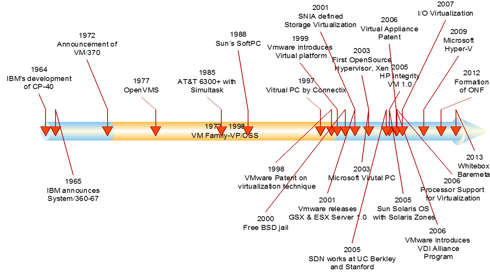

# 1.1 - Máquinas Virtuais e Contêineres

Neste capítulo faz-se um breve relato da evolução que ocorreu nos últimos anos visando a otimizar a utilização de recursos de hardware que, anteriormente, eram subutilizados.

A arquitetura cliente-servidor permite que aplicações sejam disponibilizadas com a parte que demanda maior processamento ou _back-end_ armazenada em um servidor, em geral, com mais recursos de hardware, e a parte da interface ou _front-end_, disponibilizada no lado do cliente, em geral, via um navegador web.

### Virtualização e Máquinas Virtuais

Antes da possibilidade de virtualização, os servidores físicos, em geral, tinham suas capacidades de processamento subutilizadas. A cada nova aplicação, era adquirido um novo servidor para um melhor isolamento das aplicações e, com isso, o que se tinham eram muitos servidores físicos, todos com recursos de hardware em demasia para uma única ou algumas poucas aplicações executando.

É fácil observar que esse modelo de ter aplicações exclusivas em servidores físicos não é escalável a longo prazo e, desse modo, alguma solução haveria de ser proposta e ela surgiu, a **virtualização de servidores**.

Virtualização de servidor é o que permite a execução de diversos servidores virtuais sobre o hardware de um único servidor físico, em geral, oferecendo um melhor uso dos recursos de hardware alí disponíveis \([DevMedia, 2014](https://www.devmedia.com.br/virtualizacao-de-servidores/30820)\). 

Apesar de parecer algo novo, a virtualização de servidores teve início nos anos 60, dentro da IBM \([Silva, 2007](https://www.lncc.br/~borges/doc/Virtualizacao%20de%20Sistemas%20Operacionais.TCC.pdf)\). A figura abaixo, extraída de [Chowdhury, \(2015](https://www.linkedin.com/pulse/network-virtualization-101-prelude-dhiman-chowdhury)\), ilustra um _timeline_ com a evolução da virtualização ao longo dos anos.



Basicamente, o que permite a virtualização de um servidor físico é a inclusão de uma camada adicional denominada de _hypervisor_. O modo _hypervisor_ permite total controla da CPU no servidor físico e, a partir dele, o monitor de máquinas virtuais pode gerenciar cada sistema operacional contido em cada máquina virtual \(Silva, 2007\).

A figura a seguir, extraída de [Hardren \(2014\)](https://www.devmedia.com.br/virtualizacao-de-servidores/30820), representa a camada do _hypervisor_ \(virtualização\) em relação a uma arquitetura de um servidor físico tradicional.


Segundo [Hardren \(2014\)](https://www.devmedia.com.br/virtualizacao-de-servidores/30820), o Hypervisor ou Máquina Virtual de Sistema refere-se a camada de software responsável pela criação das máquinas virtuais individuais, garantindo às mesmas, o acesso aos recursos oferecidos pelo sistema físico.

[Valiante Filho \(2020\)](http://prof.valiante.info/disciplinas/hardware/maquinas-virtuais-e-containers) distingue entre dois tipos de hypervisors: Hypervisor Tipo 1 ou _Bare Metal_; e Hypervisor Tipo 2 ou _Hosted_. As figuras abaixo, extraídas de suas notas de aula,  detalham ambos os tipos, respectivamente.

**Hypervisor Tipo 1 ou** _**Bare Metal**_

Esse tipo de hypervisor corresponde ao kernel do SO com as respectivas funções do hypervisor. É considerado o tipo mais comum de hypervisor utilizado em servidores e datacenters. Em máquinas com esse tipo de hypervisor ão se utiliza os recursos da máquina física diretamente. Os recursos da máquina física são utilizados apenas por meio das máquinas virtuais em execução sobre o hypervisor. Exemplos re produtos com essa arquitetura são: VMware, Xen, versões do Microsoft Hyper-V, Linux KVM e o XCP-ng, baseado no Xen \([Valiante Filho 2020](http://prof.valiante.info/disciplinas/hardware/maquinas-virtuais-e-containers)\) .


**Hypervisor Tipo 2 ou** _**Hosted**_

A principal diferença do hypervisor hosted em relação ao bare metal é que o hosted \(ou hospedado\) executa sobre a máquina física como uma aplicação qualquer e, sobre ele, é possível criar máquinas virtuais. Desse modo, outras aplicações, além do hypervisor, podem fazer uso da máquina física de forma simultânea. Exemplos de produtos com essa arquitetura incluem: VMware workstation, a versão específica do Microsoft Hyper-V, Gnome Boxes e o VirtualBox \([Valente Filho, 2020](http://prof.valiante.info/disciplinas/hardware/maquinas-virtuais-e-containers)\).


Com isso, as máquinas virtuais oferecem algumas vantagens, tais como:

* Isolamento dos dados. Cada máquina virtual aparanta ser uma pasta de dados;
* Podem ser movidas e copiadas facilmente, da mesma forma que se faz com arquivos;
* Todos os recursos do sistema operacional estão disponíveis para os aplicativos dentro da máquina virtual;
* Possui ferramentas de gestão conhecidas;
* Possui ferramentas de segurança comprovadas e testadas. Além do SO presente numa máquina virtual não interferir no outro, são independentes;
* É mais econômico do que operar diferentes servidores físicos;
* Permite a execução de diferentes tipos de sistemas operacionais sobre o mesmo gerenciador de máquinas virtuais.

Entretanto, apesar das vantagens, as máquinas virtuais também apresentam desvantagens. Dentre elas estão:

* Cada máquina virtual possui um SO completo dentro dela e exigem recursos significativos de RAM e CPU. Além disso, todos demandam ser instalados e, se proprietários, os custos de licenciamento;
* Devido ao aumento de cópias virtuais e recursos necessários, o ciclo de vida de desenvolvimento de software é mais complexo com o uso de máquinas virtuais;
* A movimentação de máquinas virtuais em ambiente de nuvem pode ser desafiador devido a, principalmente, o tamanho do arquivo da máquina.

Devido a principalmente essas limitações é que foram criados os contêineres.

### Contêineres

Segundo \([Valente Filho, 2020](http://prof.valiante.info/disciplinas/hardware/maquinas-virtuais-e-containers)\), contêineres possuem, na prática, um comportamento bem parecido ao das máquinas virtuais. Entretanto, são, na verdade, instâncias do sistema operacional em execução, implementando todas as técnicas disponíveis para isso.

A figura abaixo ilustra a arquitetura do sistema considerando contêineres.


Como pode ser observado na figura, a principal distinção entre os contêineres e uma máquina virtual, é que o primeiro não possui um SO completo dentro dele e, desse modo, torna-se muito mais leve e demanda menos recursos para execução. Por essa razão, o termo _lightervisors_ é usado também para distingui-los das máquinas virtuais.

Uma das plataformas mais conhecidas para uso de contêineres é o [Docker](https://www.docker.com/), mas existem outras tais como [Linux Conteiner \(LXC/LXD\)](https://linuxcontainers.org/), [Apache Mesos](http://mesos.apache.org/), [Rancher](https://rancher.com/), [Singularity](https://sylabs.io/singularity/), [Nanobox](https://nanobox.io/), [Packer](https://www.packer.io/), dentre outros.

Dentre as principais vantagens do uso de contêineres, podem ser citadas:

* A demanda por gerenciamento de recursos de TI é reduzida
* O tamanho das imagens dos contêineres é menor que das máquinas virtuais;
* A ativação de aplicativos em contêineres é mais fácil;
* As atualizações de segurança são reduzidas e simplificadas;

Entretanto, contêineres também possuem limitações e desvantagens. Dentre essas desvantagens destacam-se:

* Segurança pode ser um problema. Uma vulnerabilidade no sistema operacional hospedeiro afeta diretamente todos os contêineres;
* Menos flexibilidade de sistemas operacionais;
* Manter uma estabilidade na conexão de rede entre os contêineres pode ser desafiador.

### Docker

Pode-se dizer que o Docker, desenvolvido pela Docker Inc. é hoje considerado um ecossistema completo de conteinerização \([Red Hat, 2020](https://www.redhat.com/pt-br/topics/containers/what-is-docker)\).

Inicialmente, o Docker fazia uso da tecnologia denominada [Linux Conteiner \(LXC/LXD\)](https://linuxcontainers.org/) como sendo a base para se comunicar com o kernel do Linux e prover seus serviços de contêineres. Basicamente, a tecnologia Docker faz uso do kernel do Linux e recursos disponíveis nesse sistema, tais como o [Cgroups](https://access.redhat.com/documentation/pt-br/red_hat_enterprise_linux/6/html/resource_management_guide/ch01) e [namespaces](https://pt.qwe.wiki/wiki/Linux_namespaces) para segregar processos, ou seja, garantir o isolamento entre contêineres  \([Red Hat, 2020](https://www.redhat.com/pt-br/topics/containers/what-is-docker)\).

Desse modo, pode-se dizer que o LXC era de fundamental importância para o funcionamento do Docker. Entretanto, apesar de apoiar a comunidade do LXC/LXD, a empresa Docker Inc. tinha pouco controle da evolução do LXC/LXD o que, de certa forma, dificultava determinadas ações por parte da Docker Inc. para expandir sua tecnologia de conteinerização, além de ser difícil você confiar numa tecnologia de terceiros para dar suporte a um ponto crítico de sua aplicação.

Desse modo, a Docker Inc. optou por construir a sua própria tecnologia pra se comunicar com o kernel , denominada de [libconteiner](https://github.com/docker-archive/libcontainer).

Como surgiu no ambiente Linux, a grande maioria das imagens disponíveis no [Docker Hub](https://hub.docker.com/) \(nuvem que contém diversos tipos de imagens prontas para uso e criação de contêineres\) possui uma grande variedade de imagens que executam em Linux. Há também [imagens Windows](https://hub.docker.com/_/microsoft-windows-base-os-images) mas essas demanda licenças para serem utilizadas.

Iniciativas como o Windows  [Subsystem for Linux \(WSL\)](https://docs.microsoft.com/pt-br/windows/wsl/install-win10) passam a permitir a execução de contêineres Linux sobre o Windows. O Docker Desktop for Windows já faz isso utilizando tecnologias como VirtualBox e Hyper-V para viabilizar a execução de contêineres Linux sobre o Windows. Com a chegada do WSL2 essa integração do Docker com o ambiente Windows para a execução de contêineres Linux deve ser facilitada. Independente dessa evolução, e da disponibilidade de uma versão do Docker para Windows, o uso de Docker em ambiente Linux é mais estável e será dada prioridade a esse ambiente no contexto deste livro.

#### Terminologia do Docker

São vários os termos utilizados no contexto de conteinerização. Alguns temos básicos são listados abaixo e foram extraídos na íntegra do glossário criado pela Microsoft sobre o assunto: Terminologia do Docker \([Microsoft, 2020](https://docs.microsoft.com/pt-br/dotnet/architecture/microservices/container-docker-introduction/docker-terminology)\). Uma lista mais detalhada pode ser obtida do próprio site da [documentação do Docker](https://docs.docker.com/glossary/).

* **Imagem de contêiner**: um pacote com todas as dependências e informações necessárias para criar um contêiner. Uma imagem inclui todas as dependências \(como estruturas\), além da configuração de implantação e execução a ser usada por um runtime de contêiner. Geralmente, uma imagem deriva de várias imagens base que são camadas empilhadas umas sobre as outras para formar o sistema de arquivos do contêiner. Uma imagem é imutável depois de ser criada.
* **Dockerfile**: um arquivo de texto que contém instruções para criar uma imagem do Docker. É como um script em lotes, a primeira linha declara a imagem base com a qual começar e, em seguida, siga as instruções para instalar os programas necessários, copiar os arquivos e assim por diante, até obter o ambiente de trabalho que precisa.
* **Build**: a ação de criar de uma imagem de contêiner com base nas informações e no contexto fornecido pelo Dockerfile, além de arquivos adicionais na pasta em que a imagem é criada. Você pode criar imagens com o seguinte comando do Docker:

```text
docker build
```

* **Contêiner**: uma instância de uma imagem do Docker. Um contêiner representa a execução de um único aplicativo, processo ou serviço. Consiste no conteúdo de uma imagem do Docker, um ambiente de execução e um conjunto padrão de instruções. Ao dimensionar um serviço, você cria várias instâncias de um contêiner da mesma imagem. Ou um trabalho em lotes pode criar vários contêineres da mesma imagem, passando parâmetros diferentes para cada instância.
* **Volumes**: oferecem um sistema de arquivos gravável que o contêiner pode usar. Uma vez que as imagens são somente leitura, mas a maioria dos programas precisam gravar para o sistema de arquivos, os volumes adicionam uma camada gravável sobre a imagem de contêiner, de modo que os programas têm acesso a um sistema de arquivos gravável. O programa não sabe que está acessando um sistema de arquivos em camadas, é apenas o sistema de arquivos como de costume. Os volumes ficam no sistema de host e são gerenciados pelo Docker.
* **Repositório**: uma coleção de imagens do Docker relacionadas, rotulada com uma marcação que indica a versão da imagem. Alguns repositórios contêm várias variantes de uma imagem específica, como uma imagem que contém SDKs \(mais pesado\), uma imagem contendo apenas tempos de execução \(mais leves\), etc. Essas variantes podem ser marcadas com marcas. Um único repositório pode conter variantes de plataforma, como uma imagem do Linux e uma imagem do Windows. 
* **Docker Hub**: um registro público para carregar imagens e trabalhar com elas. O [Docker Hub](https://hub.docker.com/)

   hospeda imagens do Docker, registros públicos ou privados, cria gatilhos e ganchos da Web e integra-se com o GitHub e o Bitbucket. Aproveite e crie uma conta no Docker Hub o que permite que você poste imagens de contêineres que você venha a desenvolver.

* **Compose**: uma ferramenta de linha de comando e formato de arquivo YAML com metadados para definir e executar aplicativos de vários contêineres. Você define um único aplicativo com base em várias imagens com um ou mais arquivos .yml que podem substituir valores dependendo do ambiente. Depois de criar as definições, você pode implantar todo o aplicativo de vários contêineres com um único comando \(docker-compose up\), que cria um contêiner por imagem no host do Docker.

No decorrer do livro, outros termos que forem necessários serão explicados. Recomenda-se a leitura da Terminologia do Docker disponibilizado pela [Microsoft, \(2020\)](https://docs.microsoft.com/pt-br/dotnet/architecture/microservices/container-docker-introduction/docker-terminology). Na próxima seção discute-se o que Docker e contêineres tê a ver com DevOps \(Desenvolvimento e Operações\).

