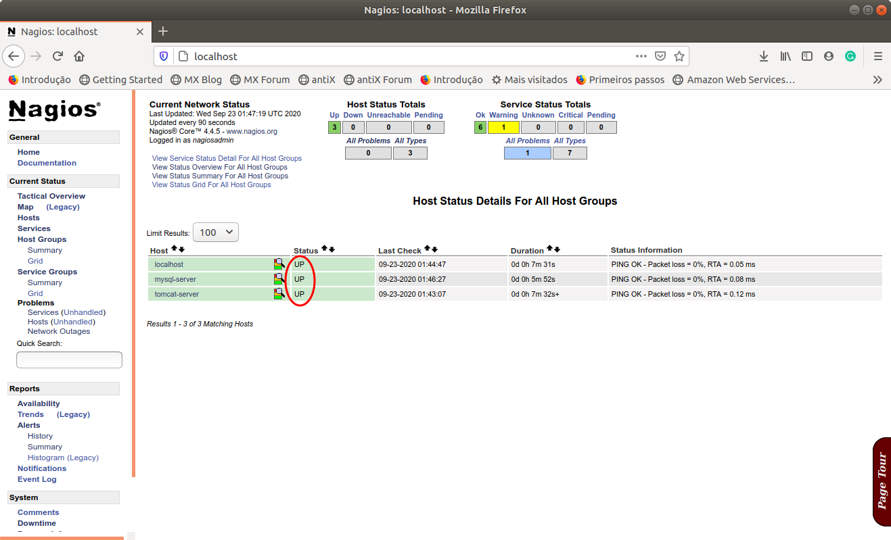
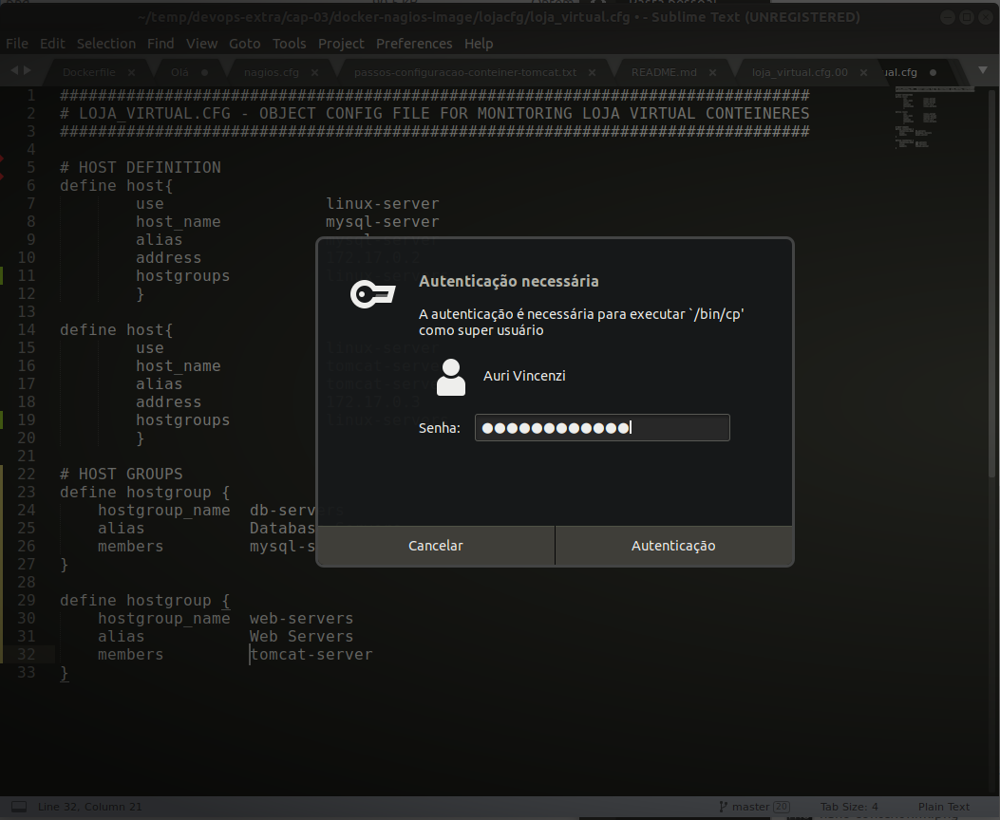
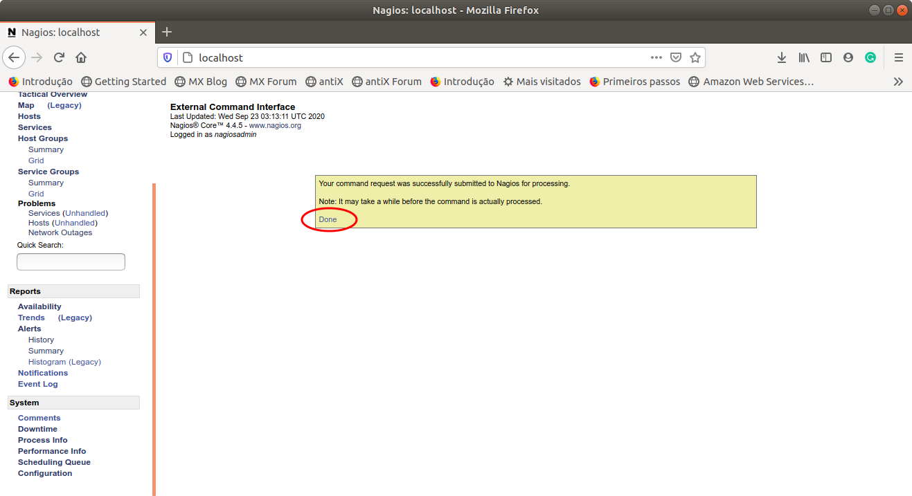

# 3.3 Monitorando Servidores do Ambiente de Produção

Uma vez instalado e em funcionamento é possível agora alterar as configurações do Nagios para monitorar os servidores de nosso interesse, ou seja, aqueles responsáveis por compor o nosso ambiente de produção.

A configuração do Nagios Core é feita por meio de arquivos de configuração que devem ser colocados em local específico e indicados ao Nagios a sua localização por meio do arquivo `nagios.cfg`.

Considerando o contêiner criado, a instalação do Nagios está localizada em `/opt/nagios` e a estrutura de diretórios de primeiro nível é dada abaixo

```text
/opt/nagios
|-- bin
|-- etc
|-- libexec
|-- sbin
|-- share
`-- var
```

Dessa estrutura, nesse primeiro momento, o diretório mais importante para nós é o `etc`, o qual contém os arquivos de configuração, conforme detalhado na estrutura abaixo:

```text
/opt/nagios/etc
|-- cgi.cfg
|-- conf.d
|-- htpasswd.users
|-- monitor
|-- nagios.cfg
|-- objects
|   |-- commands.cfg
|   |-- contacts.cfg
|   |-- localhost.cfg
|   |-- printer.cfg
|   |-- switch.cfg
|   |-- templates.cfg
|   |-- timeperiods.cfg
|   `-- windows.cfg
`-- resource.cfg

```

Uma forma simples de tentar compreender como são compostos os arquivos de configuração do Nagios é dando uma olhada nos exemplos presentes na pasta `objects`. Inclusive, um dos arquivos é chamado de `templates.cfg` e pode nos ajudar na criação dos nossos próprios arquivos `.cfg`. 

Da mesma forma que fizemos com os servidores Web e de Banco de Dados, vamos criar um arquivo `Dockerfile` para personalizar a imagem padrão do Docker Hub para atender as nossas necessidades. Os arquivos referentes a esse capítulo, estão disponíveis no repositório do GitHub, indicado abaixo.

[https://github.com/aurimrv/devops-extra/](https://github.com/aurimrv/devops-extra/)

Para fazer uso, basta fazer o clone ou o 

Segue abaixo o conteúdo do `Dockerfile` e, em seguida, é apresentada a personalização necessária para incluir os servidores do ambiente de produção.

```text
FROM jasonrivers/nagios:latest

LABEL maintainer="auri@ufscar.br, g4briel.4lves@gmail.com"

ADD lojacfg/loja_virtual.cfg /opt/nagios/etc/objects/lojacfg/

ADD nagios.cfg /opt/nagios/etc/

EXPOSE 80
```

Em relação ao que já aprendemos sobre `Dockerfile` nas outras seções, esse arquivo não apresenta novidades. Basicamente, a partir da imagem original, 1\) incluímos na imagem um novo diretório e dentro dele um novo arquivo de configuração com as informações dos servidores desejados - `ADD lojacfg/loja_virtual.cfg /opt/nagios/etc/objects/lojacfg/`; 2\) indicamos ao Nagios que há um novo arquivo de configuração a ser utilizado fornecendo para a imagem um novo arquivo `nagios.cfg` - `ADD nagios.cfg /opt/nagios/etc/`; e 3\) expomos a porta `80` para permitir a conexão externa com o contêiner.

Para obter o arquivo original da imagem, denominado `nagios.cfg`, seguiram-se os mesmos passos para a obtenção dos arquivos originais do servidor Tomcat, descritos na última parte da Seção 2.4. Tendo uma cópia desse arquivo no disco local, a única alteração feita foi a inclusão da linha abaixo no final do arquivo:

```text
cfg_file=/opt/nagios/etc/objects/lojacfg/loja_virtual.cfg
```

Essa linha indica ao Nagios para que ele considere o arquivo de configuração localizado em `/opt/nagios/etc/objects/lojacfg/loja_virtual.cfg`.

Para facilitar nossa organização e não interferir no diretório padrão de configuração do Nagios, optamos pela criação de um subdiretório `lojacfg`, abaixo do diretório `objects` do Nagios e, dentro desse diretório incluímos, inicialmente, um arquivo denominado `loja_virtual.cfg`. Tudo isso é feito pelo comando `ADD` da linha 5 do `Dockerfile` acima.

E o que há dentro desse arquivo? É nesse arquivo loja`lojacfg/loja_virtual.cfg`que descrevemos, na notação do Nagios, quais hosts desejamos que sejam incluídos para serem supervisionados. Seu conteúdo básico é apresentado abaixo:

```text
###############################################################################
# LOJA_VIRTUAL.CFG - OBJECT CONFIG FILE FOR MONITORING LOJA VIRTUAL CONTEINERES
###############################################################################

# HOST DEFINITION
define host{
        use					linux-server
        host_name 	mysql-server
        alias				mysql-server
        address			172.17.0.2
        }

define host{
        use					linux-server
        host_name 	tomcat-server
        alias				tomcat-server
        address			172.17.0.3
        }
```

O caractere \# indica comentário. Em seguida há uma seção de definição de host \(`define host`\). Nessa seção, circundada por chaves, indicamos qual o uso do host \(`use`\), qual o seu nome \(`host_name`\), qual o seu apelido \(`alias`\) e qual o seu endereço IP \(`address`\). A única informação que pode ser diferente aqui entre usuários é o número IP, o restante deve ser idêntico para todos nós.

Todos os arquivos de configuração acima estão disponíveis no GitHub do conteúdo extra do livro, cujo endereço é: [https://github.com/aurimrv/devops-extra](https://github.com/aurimrv/devops-extra). Tais arquivos estão localizados no subdiretório `cap-03/docker-nagios-image`.

Assim, assumindo que nossos Servidores Web e de Banco de Dados estão on-line nos IPs acima, utilizamos o comando abaixo para inicializar o Nagios e viabilizar o monitoramento dos mesmos.

#### Construindo a imagem do servidor personalizada

O primeiro passo é a construção da imagem personalizada por meio do `Dockerfile`. Para isso, iremos executar o comando abaixo:

```text
$ cd ~/temp/devops-extra/cap-03/docker-nagios-image
$ docker build -t nagios-server-img .
```

O resultado da execução deve ser algo semelhante ao exibido abaixo:

```text
Sending build context to Docker daemon  73.73kB
Step 1/5 : FROM jasonrivers/nagios:latest
 ---> 7c94280b661e
Step 2/5 : LABEL maintainer="auri@ufscar.br, g4briel.4lves@gmail.com"
 ---> Using cache
 ---> dfcb20e4e98e
Step 3/5 : ADD lojacfg/loja_virtual.cfg /opt/nagios/etc/objects/lojacfg/
 ---> 79440f97ab4e
Step 4/5 : ADD nagios.cfg /opt/nagios/etc/
 ---> 30d19f90c4f1
Step 5/5 : EXPOSE 80
 ---> Running in ceeedc241335
Removing intermediate container ceeedc241335
 ---> de57c2acad2e
Successfully built de57c2acad2e
Successfully tagged nagios-server-img:latest
```

#### Criando o contêiner a partir da imagem personalizada

Uma vez criada a imagem personalizada, o contêiner pode ser instanciado a partir dela com o comando abaixo:

```text
docker run --name nagios-server \ 
-v /home/auri/temp/devops-extra/cap-03/docker-nagios-image/lojacfg/:/opt/nagios/etc/objects/lojacfg/ \
-p 80:80 nagios-server-img
```

Observe que, da mesma forma que fizemos para os demais contêineres, atribuímos um nome a ele \(`nagios-server`\), associamos o diretório local contendo o arquivo de configuração da loja virtual \(`/home/auri/temp/devops-extra/cap-03/docker-nagios-image/lojacfg/`\) com o diretório dentro do contêiner \(`/opt/nagios/etc/objects/lojacfg/`\). Isso irá nos permitir editar o arquivo de configuração no host local e, após a edição, reiniciarmos o processo do Nagios no contêiner para avaliar as alterações na configuração. Finalmente, mapeamos a porta 80 do contêiner para a porta `80` do host local, de modo que o servidor de monitoramento pode ser acessado por meio do endereço [`http://localhost:80/`](http://localhost:80/).

Parte da saída resultante do comando acima é apresentada abaixo. Ao final do processo, basta acessar o endereço [`http://localhost:80/`](http://localhost:80/) para ter acesso à instância do servidor de monitoramento.

```text
Adding password for user nagiosadmin
Started runsvdir, PID is 10
checking permissions for nagios & nagiosgraph
rsyslogd: [origin software="rsyslogd" swVersion="8.16.0" x-pid="18" x-info="http://www.rsyslog.com"] start
postfix/master[16]: daemon started -- version 3.1.0, configuration /etc/postfix

Nagios Core 4.4.5
Copyright (c) 2009-present Nagios Core Development Team and Community Contributors
Copyright (c) 1999-2009 Ethan Galstad
Last Modified: 2019-08-20
License: GPL

Website: https://www.nagios.org
Nagios 4.4.5 starting... (PID=17)
Local time is Wed Sep 23 01:39:47 UTC 2020
nagios: Nagios 4.4.5 starting... (PID=17)
nagios: Local time is Wed Sep 23 01:39:47 UTC 2020
nagios: LOG VERSION: 2.0
nagios: qh: Socket '/opt/nagios/var/rw/nagios.qh' successfully initialized
nagios: qh: core query handler registered
nagios: qh: echo service query handler registered
nagios: qh: help for the query handler registered
wproc: Successfully registered manager as @wproc with query handler
nagios: wproc: Successfully registered manager as @wproc with query handler
wproc: Registry request: name=Core Worker 37;pid=37
nagios: wproc: Registry request: name=Core Worker 37;pid=37
...
...
wproc: Registry request: name=Core Worker 41;pid=41
nagios: wproc: Registry request: name=Core Worker 41;pid=41
Successfully launched command file worker with pid 49
nagios: Successfully launched command file worker with pid 49

```

A figura abaixo ilustra a tela do Nagios incluindo agora os dois servidores do nosso ambiente de produção. O acesso aos mesmos foi feito clicando-se no item Hosts do menu lateral, conforme destacado na figura. Como pode ser observado, o status do servidor Tomcat ainda aparece como pendente. Após um tempo isso deve se regularizar e o status do mesmo deve aparecer como UP, conforme imagem em sequência.




Uma vez inicializados todos os hosts que compõem o ambiente de produção, é possível navegar pelas demais opções disponíveis para tentar entender um pouco melhor o potencial da ferramenta Nagios. Em seguida, vamos alterar e melhorar um pouco mais nosso arquivo de configuração fazendo uso de recursos adicionais do Nagios.

Para viabilizar que as alterações sejam visíveis imediatamente, vamos alterar o arquivo de configuração direto dentro do servidor Nagios conectando em seu prompt de comando. Após cada alteração realizada é necessário reinicializar o processo do Nagios, mas faremos isso de dentro a sua interface web conforme apresentado a seguir.

#### Agrupamento de hosts

No nosso arquivo de configuração original da loja virtual \(`loja_virtual.cfg`\) criamos apenas dois hosts para serem monitorados. A medida que o ambiente de produção cresce é interessante agruparmos os hosts por tipo de serviço oferecido e, desse modo, fica mais fácil atribuir o gerenciamento desse grupo de hosts para diferentes especialistas, por exemplo. Ou então, definir um conjunto de regras que não se aplica a um host individual, mas sim a todos os hosts de determinado tipo.

No momento, como não incluímos os hosts `db-server` e `web-server` em qualquer grupo, se entrarmos no menu lateral na opção de **Host Groups**, o resultado é semelhando ao exibido na figura abaixo:


A definição de um grupo de hosts no Nagios pode ser feita conforme ilustrada na imagem abaixo, entre as linhas 19 e 23, as quais definem um grupo para Servidores de Banco de Dados, e outro definido entre as linhas 25 a 29.. Observa-se que um `hostgroup` tem o seu nome \(`hostgroup_name`\), um apelido \(`alias`\) e uma lista de membros \(`members`\) formada por nomes de hosts separadas por vírgula. No caso abaixo estamos definindo dois grupo para conter os Servidores de Banco de Dados e os Servidores Web, respectivamente.

Adicionalmente, conforme ilustrado nas linhas 7 e 15, usamos a opção `hostgroups` dentro da definição do `host` para indicar que tanto `mysql-server` quanto `tomcat-server` pertencem ao grupo `linux-servers` já existente.

```text
# HOST DEFINITION
define host{
        use					linux-server
        host_name 	mysql-server
        alias				mysql-server
        address			172.17.0.2
        hostgroups	linux-servers
        }

define host{
        use					linux-server
        host_name 	tomcat-server
        alias				tomcat-server
        address			172.17.0.3
        hostgroups	linux-servers
        }

# HOST GROUPS
define hostgroup {
	hostgroup_name    db-servers
	alias 		        Database Servers
	members 		      mysql-server
}

define hostgroup {
	hostgroup_name 	  web-servers
	alias 			      Web Servers
	members 		      tomcat-server
}
```

#### Alterando o arquivo local e reiniciando o servidor Nagios

Para alterar o arquivo `loja_virtual.cfg` conforme apresentado acima, podemos trabalhar com o arquivo mapeado no disco local e que está conectado com contêiner. Desse modo, ao alterarmos o arquivo localizado em `devops-extra/cap-03/docker-nagios-image/lojacfg/loja_virtual.cfg` , estamos na verdade também alterando o arquivo `/opt/nagios/etc/objects/loja_virtual.cfg` dentro do contêiner em execução.

No caso do nosso ambiente de produção, além do grupo `linux-servers` já existem na configuração padrão do Nagios, foram pensados nesses dois outros grupos de hosts: `db-servers`, e `web-servers`. Desse modo, optamos por incluir tanto o `db-server` quanto o `web-server` no grupo do `linux-servers`, e também, cada um deles de forma individual em seus respectivos grupos.

Para alterarmos o arquivo `loja_virtual.cfg` local, podemos utilizar o editor de texto de nossa preferência. No exemplo abaixo usou-se o [Sublime](https://www.sublimetext.com/3). Substituindo o conteúdo do arquivo original pelo exibido abaixo, ao salvar, será solicitado acesso de super-usuário. Isso porque, quando fizemos a associação do diretório  local com o diretório do contêiner, durante a execução do `docker run`, o proprietário do diretório local mudou de dono e, desse modo, para escrever dentro dele é necessário ser superusuário. As imagens a seguir ilustram o arquivo alterado e a tentativa de salvamento.




Após salvar o arquivo, é possível verificar se a alteração se refletiu dentro do contêiner. Para isso, basta usar o comando `docker exec` conforme abaixo:

```text
docker exec -it nagios-server bash
```

Em seguida, o comando abaixo mostra o conteúdo do arquivo `loja_virtual.cfg` dentro do contêiner.

```text
cat /opt/nagios/etc/objects/lojacfg/loja_virtual.cfg
```

Como será observado, o conteúdo será idêntico ao da tela do Sublime acima.

Resta agora aplicar as alterações no servidor Nagios. Para isso, basta reiniciarmos o processo que controla o Nagios e isso pode ser feito de forma mais fácil direto via a interface do servidor conforme ilustra a sequência de telas a seguir.

1\) Navegar até o final do menu lateral e escolher a opção: **Process Info**.


2\) Na tela que irá abrir, escolher a opção **Restart the Nagios process**, conforme destacado na figura.




3\) Se tudo correr bem, os dados do arquivo `loja_virtual.cfg` serão recarregados e as informações sobre **Host Groups** serão atualizados, conforme ilustrado na tela a seguir.


**IMPORTANTE:** caso alterarmos nosso arquivo `.cfg` de forma indevida ou com algum erro de sintaxe, ao tentar reinicializar o servidor podemos não conseguir e, nesse caso, teremos que descobrir o que esta errado e tentarmos reiniciar o processo. Se não for possível pela interface do navegador, a solução é reiniciar desde a construção da imagem, descrito no início desta seção.

No caso acima, conforme pode ser observado, a reinicialização ocorreu com sucesso e os três grupos de hosts foram formados.

