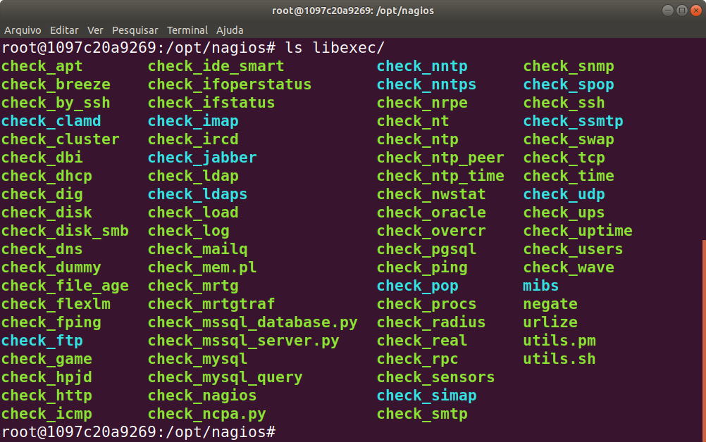

# 3.4 Comandos de Verificação do Nagios

Conforme comentado, a verificação do status de servidores e serviços oferecidos pelo Nagios é feita por meio de comandos específicos para cada tipo de verificação desejada.

Tal comando, nada mais é do que um script que executa determinadas ações e devolve para  Sistema Operaciona \(SO\) um código de retorno indicando como foi seu encerramento. São vários scripts de verificação disponíveis e outros podem ser incluídos por meio de plugins ou até mesmo desenvolvidos por nós mesmos para realizar verificações específicas.

No contêiner com a instalação do Nagios que fizemos uso, os programas de verificação já disponíveis estão listados em `/opt/nagios/libexec`. Conforme mostra a figura abaixo.



Desse modo, ao executar cada script desses, com seus respectivos parâmetros, o Nagios coleta o código de retorno do mesmo e sinaliza em sua interface qual o status do host ou serviço em monitoramento. Cada código de retorno do script apresenta um significado para o SO e para o Nagios e é por meio dele que o Nagios indica que algo está operacional ou não no sistema.

Por exemplo, estando no prompt de comando do Servidor Nagios é possível consultar se o servidor Tomcat está respondendo no porto correto com o seguinte comando `check_http`:

```text
./check_http -H 172.17.0.3
```

Por padrão, esse comando verifica se é possível a conexão via HTTP no host informado como parâmetro \(`172.17.0.3`\) no porto `80` que, no caso do Servidor Web com Tomcat não está disponível. Desse modo, o script retorna um código indicador de erro para o SO. Para verificar qual o código de retorno do último comando em execução no `bash`, basta digitar `echo $?` e o código é exibido, conforme sequência de comandos e saídas abaixo. No caso, a consulta à conexão HTTP no host `172.17.0.3`no porto padrão `80` não foi bem sucedida e o código de retorno foi 2.

```text
$ cd /opt/nagios/libexec
$ ./check_http -H 172.17.0.3
connect to address 172.17.0.3 and port 80: Connection refused
HTTP CRITICAL - Unable to open TCP socket

$ echo $?
2
```

Ao realizar a mesma consulta, mas agora no porto 8080, o resultado é diferente, conforme ilustrado na sequência de comandos e saídas abaixo:

```text
$./check_http -H 172.17.0.3 -p 8080
HTTP WARNING: HTTP/1.1 404 Not Found - 128 bytes in 0.109 second response time |time=0.108563s;;;0.000000 size=128B;;;0

$ echo $?
1
```

O código de retorno 1 indica que o primeiro estágio de verificação mas o comando não foi executado com 100% de sucesso. Isso porque, no nosso servidor, não há aplicações executando na raiz do `webapps`, para executar a aplicação precisamos fornecer uma URL do tipo [http://localhost:8080/sample/](http://localhost:8080/sample/) ou [http://localhost:8080/devopsnapratica/](http://localhost:8080/devopsnapratica/). Se fornecermos apenas a URL [http://localhost:8080/](http://localhost:8080/), não há conteúdo disponível ai e o teste não finaliza 100%.

Um teste mais genérico que pode ser feito em qualquer servidor é o do `check_ping`. Esse comando recebe três argumentos obrigatórios, conforme demonstrado abaixo:

```text
$ ./check_ping -H 172.17.0.2 -w 10,2% -c 20,5%
PING OK - Packet loss = 0%, RTA = 0.07 ms|rta=0.067000ms;10.000000;20.000000;0.000000 pl=0%;2;5;0
$ echo $?
0

$ ./check_ping -H 172.17.0.3 -w 10,2% -c 20,5%
PING OK - Packet loss = 0%, RTA = 0.08 ms|rta=0.080000ms;10.000000;20.000000;0.000000 pl=0%;2;5;0

$ echo $?
0
```

O primeiro argumento `-H` define o host a receber o ping. O segundo, `-w 10,2%`, indica que o Nagios irá emitir um _warning_ caso o tempo de resposta seja superior a `10ms` e haja mais de `2%` de perda de pacotes na comunicação. O terceiro, `-c 20,5%`, é o limite considerado crítico de tempo de resposta acima de `20ms` com mais de `5%` de perda de pacotes. No exemplo acima, como pode ser observado, tanto o Servido de Banco de Dados, quanto o Servidor Web, respeitaram os limites estabelecidos e o código de retorno foi de sucesso `0`.

Assim sendo, o código de retorno dos comandos de verificação, segundo [Sato \(2018\)](https://www.casadocodigo.com.br/products/livro-devops), resumem-se a:

* 0 – OK: verificação ocorreu com sucesso e é representado pelo status verde na interface web;
* 1 – WARNING: verificação passou parcialmente e é representado pelo status amarelo na interface web;
* 2 – CRITICAL: verificação falhou ou há algo de errado e é representado pelo status vermelho na interface web; e
* 3 – UNKNOWN: verificação não é capaz de definir se o serviço está bem ou não e é representado pelo status laranja na interface web.

Finalmente, cabe aqui uma ressalva. Conforme destacado por [Sato \(2018\)](https://www.casadocodigo.com.br/products/livro-devops), nem todos os comandos de verificação podem ser utilizados para consultar informações em hosts remotos. Um deles é o `check_disk`, por exemplo, que não possui o parâmetro `-H`. Entretanto, caso seja necessário utilizar alguma verificação desse tipo, o Nagios oferece três possibilidades conforme mencionado a seguir \([Sato, 2018](https://www.casadocodigo.com.br/products/livro-devops)\):

* [Checagem por SSH](https://nagios-plugins.org/doc/man/check_by_ssh.html): nesse caso, a verificação de informações no host remoto supervisionado é feita por meio do comando `check_by_ssh`. Com isso, o Nagios é capaz de conectar-se remotamente ao servidor supervisionado e executar as verificações que devem ser feitas localmente;
* [Checagem ativa com NRPE](https://assets.nagios.com/downloads/nagioscore/docs/nrpe/NRPE.pdf): trata-se de um plugin, denominado _Nagios Remote Plugin Execution_ \(NRPE\) que viabiliza a execução de verificadores que só podem ser utilizados localmente. O plugin executa de forma ativa, a partir da requisição do Nagios;
* [Checagem passiva com o NCSA](https://assets.nagios.com/downloads/nagiosxi/docs/How-to-Use-the-NSCA-Addon.pdf): trata-se de um plugin, denominado _Nagios Service Check Acceptor_ \(NCSA\), que executa de forma passiva no host supervisionado, e, de tempos em tempos, executa as verificações locais, encaminhando os resultados para o Nagios.

Caso necessite fazer uso desses recursos do Nagios, recomenda-se consultar a documentação oficial sobre os mesmos, indicadas acima, ou ainda realizar pesquisa na Internet sobre o assunto. Há muita documentação disponível sobre os mesmos. No que se refere a esse curso, faremos uso apenas dos verificadores que possam ser utilizados diretamente, sem a necessidade de execução de forma remota.

A seguir, faremos usos de algumas verificações adicionais nos nossos servidores do ambiente de produção e veremos como tais verificadores podem ser incluídos no arquivo de configuração `loja_virtual.cfg`.

