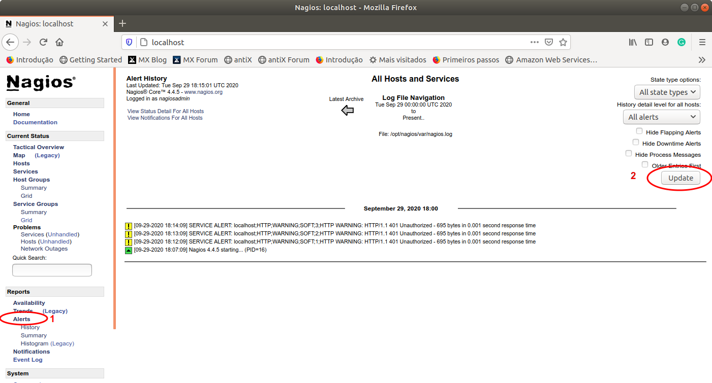

# 3.5 Criando Verificações Mais Específicas

Como observamos na seção anterior, o Nagios pode ser estendido com uma série de verificadores. Utilizamos alguns via linha de comando para realizar testes nos nossos servidores. Um outro exemplo ainda não exploraro, é o comando `check_mysql`, que avalia o nosso servidor MySQL. Estando conectado ao prompt do `nagios-server`, a sintaxe do comando é dada por:

```text
$ /opt/nagios/libexec/check_mysql --help
check_mysql v2.2.1 (nagios-plugins 2.2.1)
Copyright (c) 1999-2014 Nagios Plugin Development Team
	<devel@nagios-plugins.org>

This program tests connections to a MySQL server


Usage:
 check_mysql [-d database] [-H host] [-P port] [-s socket]
       [-u user] [-p password] [-S] [-l] [-a cert] [-k key]
       [-C ca-cert] [-D ca-dir] [-L ciphers] [-f optfile] [-g group]
...
```

Como pode ser observado, esse comando serve para realizarmos testes na conexão com o servidor MySQL. No nosso exemplo, uma possível execução desse comando poderia ser:

```text
$ /opt/nagios/libexec/check_mysql -d loja_schema -H 172.17.0.2 -u loja -p lojasecret
Uptime: 4336  Threads: 4  Questions: 4664  Slow queries: 0  Opens: 1155  
Flush tables: 1  Open tables: 171  Queries per second avg: 1.075|
Connections=21c;;; Open_files=16;;; Open_tables=171;;; 
Qcache_free_memory=1031352;;; Qcache_hits=0c;;; Qcache_inserts=0c;;; 
Qcache_lowmem_prunes=0c;;; Qcache_not_cached=1547c;;; 
Qcache_queries_in_cache=0;;; Queries=4665c;;; Questions=4650c;;; 
Table_locks_waited=0c;;; Threads_connected=4;;; Threads_running=1;;; 
Uptime=4336c;;;

$ echo $?
0
```

Observa-se que a execução do comando acima vrificou a conectividade com nosso servidor, especificamente a existência da base de dados `loja_schema`, com autenticação pelo usuário `loja` e senha `lojasecret`. A execução foi bem sucedida uma vez que o retorno para o SO foi `0`, conforme comentado na Seção 3.4 e apresentado na linha 12 acima.

Entretanto, para que tais verificadores possam ser utilizados de forma integrada ao Nagios, dentro de sua interface web, os mesmos precisam ser declarados em seus arquivos de configuração para serem utilizados como serviços. Abaixo, segue um trecho do nosso arquivo loja\_virtual.cfg, com a declaração de um comando que faz uso de um verificador do diretório `/opt/nagios/libexec` . Uma vez declarado o comando, o mesmo pode ser empregado na verificação de um serviço de forma automática pelo Nagios.

```text
###############################################################################
# LOJA_VIRTUAL.CFG - OBJECT CONFIG FILE FOR MONITORING LOJA VIRTUAL CONTEINERES
###############################################################################

###############################################################################
# COMMANDS DEFINITION
###############################################################################
# 'check_mysql' command definition
define command{
        command_name    check_mysql
        command_line    /opt/nagios/libexec/check_mysql -H '$HOSTADDRESS$'
}

# 'check_mysql_cmdlinecred' command definition
define command{
        command_name    check_mysql_cmdlinecred
        command_line    /opt/nagios/libexec/check_mysql -H '$HOSTADDRESS$' -u '$ARG1$' -p '$ARG2$'
}

# 'check_mysql_database' command definition
define command{
        command_name    check_mysql_database
        command_line    /opt/nagios/libexec/check_mysql -d '$ARG3$' -H '$HOSTADDRESS$' -u '$ARG1$' -p '$ARG2$'
}

###############################################################################
# HOST DEFINITION
###############################################################################
define host{
        use					    linux-server
        host_name 			mysql-server
        alias				    mysql-server
        address				  172.17.0.2
        hostgroups			linux-servers
        check_command		check_mysql_database!loja!lojasecret!loja_schema
}
...
```

Por exemplo, observe o trecho entre as linhas 9 e 12 acima. Nesse trecho, estamos definindo um comando \(`define command`\) cujo nome interno \(`command_name`\) a ser utilizado pelo Nagios será `check_mysql`. A linha de comando \(`command_line`\) para o serviço fará uso do comando `/opt/nagios/libexec/check_mysql -H '$HOSTADDRESS$'`. Observa-se que o parâmetro -H faz uso de uma variável interna do Nagios que permite identificar o host corrente, no caso, no nosso servidor MySQL com o IP `172.17.0.2`.

O comando definido entre as linhas 20 a 21 é que faz a verificação da base de dados \(check\_mysql\_database\). Nesse caso, além da variável `$HOSTADDRESS$` , aparecem outras variáveis, identificadas por `$ARG1$`, `$ARG2$` e `$ARG3$`. Tais variáveis são instanciadas em função dos parâmetros passados na invocação do comando de verificação na linha 35 do exemplo acima.

```text
check_mysql_database!loja!lojasecret!loja_schema
```

Ou seja, como pode ser observado, dentro de um host, é possível utilizar um `check_command` e, fazer a invocação de um comando declarado internamente no Nagios. Para fazermos mais de uma verificação em um mesmo host, vamos utilizar o conceito de `service`, conforme apresentado no final desta seção.

No exemplo acima, estamos fazendo a invocação do comando `check_mysql_database` no host `mysql-server`. As exclamações na frente desse comando, fornecem os parâmetros necessários para uso do serviço. No exemplo, são fornecidas três informações em sequência: `!loja!lojasecret!loja_schema`. Cada exclamação representa um dos argumentos passados para o check\_mysql\_database. Desse modo, as variáveis `$ARG1$`, `$ARG2$` e `$ARG3$` são instanciadas, respectivamente, com os valores  `loja`, `lojasecret`, e `loja_schema`. Em posse dessas informações o Nagios consegue invocar o comanco `check_mysql`, conforme linha 23, pois já possui todas as informações necessárias. 

A `'$ARG3$'` é utilizada no parâmetro `-d` \(`database`\), a variável `'$HOSTADDRESS$'` obtida automaticamente é usada para instanciar o parâmetro `-H` \(`host`\) e as variáveis  `'$ARG1$'` e `'$ARG2$'` são usadas para instanciar os parâmetros `-u` e `-p`, `user` e `password`, respectivamente.

No caso do comando `check_mysql_database`, precisamos definí-lo manualmente mas, em geral, ao instalar o plugin de verificação, já pe gerado automaticamente um arquivo, `mysql.cfg`, contendo esses comandos. Como esse arquivo não estava presente no nosso contêiner Nagios que utilizamos, fizemos a inclusão do mesmo de forma manual no nosso arquivo `loja_virtual.cfg`. Na instalação padrão do nosso contêiner, há um arquivo `commands.cfg`, localizado em `/opt/nagios/etc/objects`, contendo outros comandos que podem ser utilizados dentro dos nossos arquivos de configuração para melhorar o monitoramento dos servidores. 

#### Status das verificações no Nagios

Uma vez incluída uma verificação em determinado host, é possível monitorar seu status dentro do Nagios. No exemplo abaixo, a sequência de telas permite observar quais verificações estão habilitadas em quais hosts. 

Basta seguir a opção, **Configuration** \(último ítem do menu lateral\) e, em seguida, clicar em **Continue**.


Será apresentada a tela abaixo, na qual é possível confimar que, para o servidor `mysql-server,` o comando `check_mysql_database` está em uso para a verificação do host. Da mesma forma, para os demais hostas, está em uso a verificação de `check-host-alive`.


Ao clicar no nome da notificação é possível obter mais detalhes de sua invocação.


Para ter certeza que o alerta está funcionando vamos interromper o funcionamento do servidor de banco de dados com os comandos abaixo:

```text
docker stop mysql-server
docker rm mysql-server
```

O primeiro pára o contêiner e o segundo remove o contêiner para permitir sua criação a posteriori. Após o encerramento do contêiner o Nagios leva um tempo até detectar que o seviço não está operacional, conforme ilustrado na sequência de imagens a seguir.

Por exemplo, para verificar os alertas ativos basta clicar na opção **Alerts** no menu lateral. 




Assim que a detecção é detectada pelo Nagios, um alerta é emitido, conforme pode ser observado na figura a seguir.


Tal alerta se refleta na tela dos Hosts, indicando que o `mysql-serve`r está DOWN.


Detectado o problema,  a equipe de operações pode tomar as ações necessárias para reativar o servidor e o Nagios passa a detectar a volta da normalidade do ambiente de produção, conforme ilustrado a seguir.


#### Realizando mais de uma verificação por host

Como mencionado anteriormente, o comando `check_command` pode ser utilizado em diferentes definições do Nagios. Dento de um define host ele pode aparecer ua única vez. Entretanto, pode ser que tenhamos a necessidade de realizar diferentes verificações num mesmo host ou num grupo de hosts. É nesse caso que utilizamos o conceito de `service`. 

Desse modo, diversos tipos de verificações podem ser incluídas no arquivo `loja_virtual.cfg`. A seguir é apresentado o arquivo final com outras inclusões de checagem nos nossos servidores de produção, além das que já estvam sendo feitas.

Entre as linhas 73 a 97 do arquivo abaixo, fazemos uso do define service. Em todos eles utilizamos a verificação para um grupo de hosts \(`hostgroup_name`\), mas poderíamos substituir o `hostgroup_name` por `host_name` e realizar a verificação desejada em um host específico. 

```text
###############################################################################
# LOJA_VIRTUAL.CFG - OBJECT CONFIG FILE FOR MONITORING LOJA VIRTUAL CONTEINERES
###############################################################################

###############################################################################
# COMMANDS DEFINITION
###############################################################################
# 'check_mysql' command definition
define command{
        command_name    check_mysql
        command_line    /opt/nagios/libexec/check_mysql -H '$HOSTADDRESS$'
}

# 'check_mysql_cmdlinecred' command definition
define command{
        command_name    check_mysql_cmdlinecred
        command_line    /opt/nagios/libexec/check_mysql -H '$HOSTADDRESS$' -u '$ARG1$' -p '$ARG2$'
}

# 'check_mysql_database' command definition
define command{
        command_name    check_mysql_database
        command_line    /opt/nagios/libexec/check_mysql -d '$ARG3$' -H '$HOSTADDRESS$' -u '$ARG1$' -p '$ARG2$'
}

# 'check_tomcat' command definition
define command{
        command_name    check_tomcat
        command_line    /opt/nagios/libexec/check_http -H '$HOSTADDRESS$' -p '$ARG1$'
}


###############################################################################
# HOST DEFINITION
###############################################################################
define host{
        use					    linux-server
        host_name 	    mysql-server
        alias				    mysql-server
        address				  172.17.0.2
        hostgroups			linux-servers
        check_command		check_mysql_database!loja!lojasecret!loja_schema
}

define host{
        use					    linux-server
        host_name 			tomcat-server
        alias				    tomcat-server
        address				  172.17.0.3
        hostgroups			linux-servers
        check_command		check_tomcat!8080
}

###############################################################################
# HOST GROUPS DEFINITION
###############################################################################
define hostgroup {
	hostgroup_name 	db-servers
	alias 			    Database Servers
	members 		    mysql-server
}

define hostgroup {
	hostgroup_name 	web-servers
	alias 			    Web Servers
	members 		    tomcat-server
}


###############################################################################
# SERVICES DEFINITION
###############################################################################
define service {
    use                     local-service,graphed-service
    hostgroup_name			    db-servers             
    service_description     PING
  	check_command			      check_ping!100.0,20%!500.0,60%
}

define service {
    use                     local-service,graphed-service
    hostgroup_name			    db-servers
    service_description     TCP
  	check_command			      check_tcp!3306
}

define service {
    use                     local-service,graphed-service
    hostgroup_name			    web-servers
    service_description     TCP
  	check_command 		      check_tcp!8080
}

define service {
    use                     local-service,graphed-service
    hostgroup_name			    web-servers
    service_description     TCPSSL
  	check_command			      check_tcp!8443
}
```

Por exemplo, para os servidores do grupo db-servers estamos verificando a resposta ao `PING` e também a disponibilidade de conexão `TCP` no porto `3306`, utilizado pelo MySQL.

Já para os servidores do grupo web-servers estamos testado a conexão `TCP` nos portos `8080` e `8443`, utilizados pelo Tomcat para a conexão normal e segura.

Desse modo, observa-se que o Nagios é uma ferramenta de monitoramento bastante versátil. Recomenda-se um estudo dos arquivos de configuração disponíveis em `/opt/nagios/etc/objects` para mais informações sobre o monitoramento de objetos como Nagios. Lá existem exemplos para o monitoramento de _switches_ e impressoras, dentre outros.

