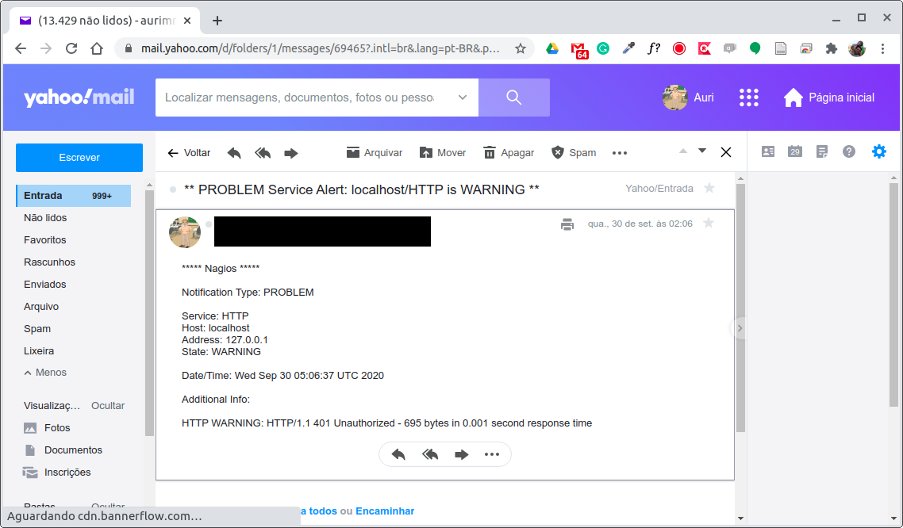
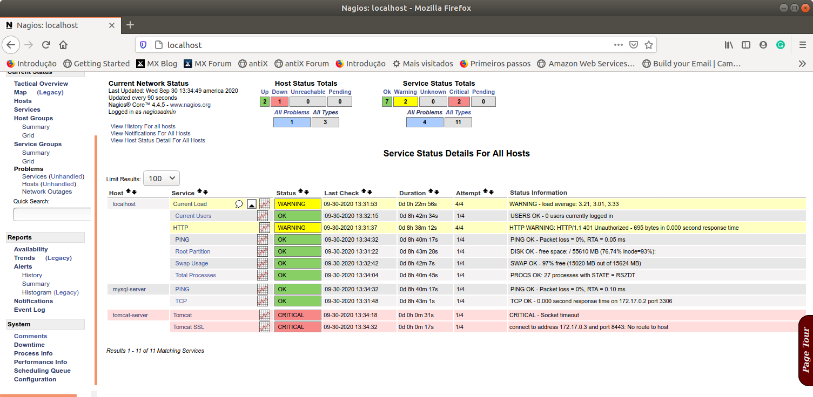
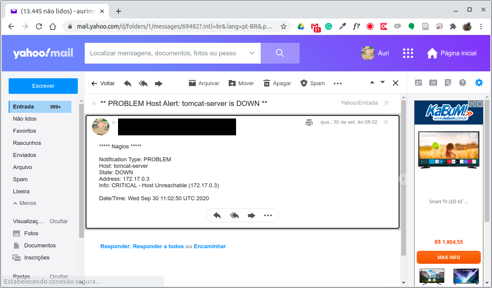

# 3.6 Criando Alertas

Até o momento configuramos o Nagios para que ele detecte e exponha os problemas encontrados em sua interface web. Entretanto, um sistema de monitoramento de qualidade deve ser capaz também de alertar usuários, ou grupos específicos de usuários, sobre tais problemas, mesmo quando eles naõ estão visualizando o painel do Nagios.

De maneira geral, três configurações são necessárias para o recebimento de alertas.

1. Configuração dos comandos para o envio de alertas, da mesma forma como configuramos os comandos para verificação do `Tomcat`, por exemplo; 
2. Configuração do período de tempo em que os alertas devem ser emitidos; e
3. Configuração do usuário, ou grupo de usuários, que será\(ão\) alertado\(s\).

#### Comando para o recebimento de alertas

O Nagios permite o envio e alertas de diferentes tipos, desde um e-mail, até o uso de serviços de mensagem de SMS, pager, dentre outras possibilidades. Por padrão, a notificação por e-mail já vem habilitada. Já o uso de SMS, por exemplo, exige outras configurações e um servidor dedicado para o envio de mensagens os quais, em geral, são pagos.

Desse modo, a título de ilustração, faremos uso do comando padrão de notificação por e-mail de possíveis ocorrências em hosts \(`notify-host-by-email`\) ou serviços \(`notify-service-by-email`\) monitorados pelo Nagios. Os comandos de notificação estão definidos no arquivo `/opt/nagios/etc/objects/commands.cfg`, conforme apresentados abaixo:

```text
...
# 'notify-host-by-email' command definition
define command{
        command_name    notify-host-by-email
        command_line    /usr/bin/printf "%b" "***** Nagios *****\n\nNotification Type: $NOTIFICATIONTYPE$\nHost: $HOSTNAME$\nState: $HOSTSTATE$\nAddress: $HOSTADDRESS$\nInfo: $HOSTOUTPUT$\n\nDate/Time: $LONGDATETIME$\n" | /usr/bin/mail -s "** $NOTIFICATIONTYPE$ Host Alert: $HOSTNAME$ is $HOSTSTATE$ **" $CONTACTEMAIL$
}

# 'notify-service-by-email' command definition
define command{
        command_name    notify-service-by-email
        command_line    /usr/bin/printf "%b" "***** Nagios *****\n\nNotification Type: $NOTIFICATIONTYPE$\n\nService: $SERVICEDESC$\nHost: $HOSTALIAS$\nAddress: $HOSTADDRESS$\nState: $SERVICESTATE$\n\nDate/Time: $LONGDATETIME$\n\nAdditional Info:\n\n$SERVICEOUTPUT$\n" | /usr/bin/mail -s "** $NOTIFICATIONTYPE$ Service Alert: $HOSTALIAS$/$SERVICEDESC$ is $SERVICESTATE$ **" $CONTACTEMAIL$
}
...
```

#### Quando receber alertas

A decisão de quando os alertas devem ser recebidos é feito pelo Nagios a partir da configuração de períodos de tempo. Tais definições estão armazenadas por padrão no arquivo `/opt/nagios/etc/objects/timeperiods.cfg`. Por exemplo, uma das definições é a do período 24x7 que representa que alertas podem ser emitidos 24 horas por dia nos 7 dias da semana.

Observa-se que no caso de equipes que lidam com operações precisam manter determinados tipos de sistemas de forma ininterrupta e, alertas podem chegar a qualquer horário. A definição desse padrão de período de alerta, extraída do `timeperiods.cfg`, é apresentada abaixo:

```text
...
define timeperiod {

    name                    24x7
    timeperiod_name         24x7
    alias                   24 Hours A Day, 7 Days A Week

    sunday                  00:00-24:00
    monday                  00:00-24:00
    tuesday                 00:00-24:00
    wednesday               00:00-24:00
    thursday                00:00-24:00
    friday                  00:00-24:00
    saturday                00:00-24:00
}
...
```

#### A quem alertar em caso de problemas

Finalmente, resta definir quem será alertado em caso de problemas. Podemos alertar tanto um usuário específico como um grupo de usuários responsável pelas operações. No exemplo abaixo vamos considerar que apenas um usuário necessita ser alertado.

Também por padrão, o Nagio traz um arquivo com uma configuração padrão localizado em `/opt/nagios/etc/objects/contacts.cfg`

Para que possamos alterar esse arquivo de modo que o e-mail padrão passa a ser o nosso, a seguir é apresentada a configuração original e, em seguida, a configuração personalizada que faremos. Posteriormente, para que essa alteração faça efeito, iremos também alterar o nosso Dockerfile de modo que o conteúdo desse arquivo alterado substitua o conteúdo da imagem original e, numa próxima inicialização do servidor, os nossos dados não se percam.

```text
...
define contact {
    contact_name            nagiosadmin             ; Short name of user
    use                     generic-contact         ; Inherit default values from generic-contact template (defined above)
    alias                   Nagios Admin            ; Full name of user
    email                   nagios@localhost ; <<***** CHANGE THIS TO YOUR EMAIL ADDRESS ******
}
...
```

As linhas de 3 a 5 vamos manter conforme o original. O símbole de ";" no arquivo `cfg` é utilizado para incluir comentário no final das linhas. Além disso, iremos incluir algumas outras configurações e também alterar o endereço de e-mail conforme o desejado. A configuração final, no meu caso, segue abaixo:

```text
...
define contact {
    contact_name                    nagiosadmin
    use                             generic-contact
    alias                           Nagios Admin
    service_notification_period     24x7
    host_notification_period        24x7
    service_notification_options    w,u,c,r
    host_notification_options       d,r
    service_notification_commands   notify-service-by-email
    host_notification_commands      notify-host-by-email
    email                           aurimrv@yahoo.com.br
}
...
```

Observa-se no arquivo alterado que foram incluídos algumas opções em relação notificação, unindo ao contato, as restrições de tempo e tipos de notificações de interesse.

Por exemplo, `service_notification_period` e `host_notification_period` definidos como `24x7` indicam que esse usuário receberá notificações a todo e qualquer momento do dia caso algum dos problemas indicados em `service_notification_options` e `host_notification_options` ocorram. No caso de `service_notification_options`, as opções `w,u,c,r` indicam, respectivamente, os status do serviço de `WARNING (w)`, `UNKNOWN (u)`, `CRITICAL (c)`, ou `RECOVERY (r)`. Já no caso de `host_notification_options`, o `d,r` representam, respectivamente, o status de `DOWN (d)` e `RECOVERY (r)` de um host. Desse modo, havendo qualquer dessas ocorrências em hosts ou serviços um e-mail será encaminhado alertando o respectivo usuário.

Para que essas alterações se tornem permanentes em nossa imagem, o arquivo `Dockerfile` foi alterado conforme abaixo:

```text
FROM jasonrivers/nagios:latest

LABEL maintainer="auri@ufscar.br, g4briel.4lves@gmail.com"

ADD lojacfg/loja_virtual.cfg /opt/nagios/etc/objects/lojacfg/
ADD contacts.cfg /opt/nagios/etc/objects/

ADD nagios.cfg /opt/nagios/etc/

EXPOSE 80
```

Observa-se na linha 6 que enviamos para a imagem original um novo arquivo `contacts.cfg` com o conteúdo alterado e, desse modo, o Nagios passa a encaminhar os alertas conforme definido.

Para testar se tudo está funcionando, basta executar os comandos abaixo que irão interromper a execução do Nagios, gerar novamente a imagem do servidor de Monitoramento e, posteriormente, iremos interromper a execução do Servidor Web e verificar se o alerta surtiu efeito:

```text
cd ~/temp/devops-extra/cap-03/docker-nagios-image

$ docker stop nagios-server
nagios-server

$ docker rm nagios-server
nagios-server

$ docker build -t nagios-server-img .

Sending build context to Docker daemon  77.31kB
Step 1/6 : FROM jasonrivers/nagios:latest
 ---> 7c94280b661e
Step 2/6 : LABEL maintainer="auri@ufscar.br, g4briel.4lves@gmail.com"
 ---> Using cache
 ---> dfcb20e4e98e
Step 3/6 : ADD lojacfg/loja_virtual.cfg /opt/nagios/etc/objects/lojacfg/
 ---> 7bfb9bc8bb12
Step 4/6 : ADD contacts.cfg /opt/nagios/etc/objects/
 ---> d19445a7656a
Step 5/6 : ADD nagios.cfg /opt/nagios/etc/
 ---> dc826494f635
Step 6/6 : EXPOSE 80
 ---> Running in 133983dabcf7
Removing intermediate container 133983dabcf7
 ---> 4be5e7946b64
Successfully built 4be5e7946b64
Successfully tagged nagios-server-img:latest

$ docker run --name nagios-server -v /home/auri/temp/devops-extra/cap-03/docker-nagios-image/lojacfg/:/opt/nagios/etc/objects/lojacfg/ -p 80:80 nagios-server-img
```

Entretanto, para que o envio de mensagens seja efetivado, é necessária a configuração do `postfix` ou do `sendmail` no contêiner. Desse modo, as configurações acima funcionam se um desses mecanismos de envio de e-mails já esteja configurado no contêiner. Como a configuração de servidor de saída `SMTP` de serviços como GMail ou Yahoo utilizam certificados e autenticação por SSL, o processo de configuração é mais trabalhoso. Caso queira configurar utilizando suas credenciais, siga os passos descritos na última seção desse capítulo. Por hora, vamos assumir que as configurações do `postfix` estão corretas e o Nagios é capaz de enviar e-mails de alertas.

Por exemplo, assim que inicializamos nosso servidor Nagios é emitido um `WARNING` no serviço `HTTP` do `localhost`. Tal evento, transcorrido o tempo de notificação, é comunicado ao usuário cadastrado, conforme mensagem de e-mail abaixo:



Outro teste que realizamos foi a interrupção do nosso Servidor Web utilizando os comandos `docker stop tomcat-server` e `docker rm tomcat-server`. Após o encerramento do servidor, o Nagios detecta a indisponibilidade e, após um tempo, emite a notificação para os interessados, conforme telas abaixo.





#### Passo a passo para a configuração do Postfix para contas GMail

Por padrão, o nosso contêiner padrão já vem com o `Postfix` instalado. O que faremos é atualizá-lo para poder executar as configurações necessárias. A instalação dos pacotes do passo a passo a seguir serão incluídas diretamente no `Dockerfile` para que a imagem gerada passe a ter o servidor `postfix` configurado automaticamente mas, primeiro, é necessário a geração dos arquivos de configuração, e esses depende das credenciais de login de cada um na conta do GMail.

O primeiro passo é a criação de uma conta no GMail e a geração de uma senha de aplicativo para uso no processo. Tal senha pode ser obtida seguindo [esse tutorial](https://support.google.com/accounts/answer/185833?hl=pt-BR). A título de exemplo, assumiremos que `USER` corresponde ao nome de usuário e `PASSWORD` a senha de aplicativo gerada para acesso ao serviço de envio de mensagens via GMail. 

Feito isso, vamos inicializar o nosso servidor Nagios conforme ilustrado abaixo:

```text
$ cd ~/temp/devops-extra/cap-03/docker-nagios-image/
$ docker run --name nagios-server -v /home/auri/temp/devops-extra/cap-03/docker-nagios-image/lojacfg/:/opt/nagios/etc/objects/lojacfg/ -p 80:80 nagios-server-img
```

Uma vez inicializado, vamos abrir um outro terminal de comando para iniciar a instalação e configuração dos pacotes necessários:

```text
$ cd ~/temp/devops-extra/cap-03/docker-nagios-image/
$	docker exec -it nagios-server /bin/bash
```

1\) Configuração do Postfix

Instalação dos pacotes para utilizar o Postfix com o GMail

```text
$ apt update
$ apt install -y vim nano postfix mailutils libsasl2-2 ca-certificates libsasl2-modules
```

2\) Alterando o arquivo de configuração do Postfix

```text
nano /etc/postfix/main.cf
```

Primeiro, elimine desse arquivo a linha com o conteúdo

```text
relayhost=
```

Em seguida, inclua as linhas abaixo no final do arquivo

```text
relayhost = [smtp.gmail.com]:587
smtp_sasl_auth_enable = yes
smtp_sasl_password_maps = hash:/etc/postfix/sasl/sasl_passwd
smtp_sasl_security_options = noanonymous
smtp_tls_CAfile = /etc/ssl/certs/ca-certificates.crt
smtp_use_tls = yes
```

3\) Definir o login e a senha do GMail no arquivo abaixo:

```text
nano /etc/postfix/sasl/sasl_passwd
```

O conteúdo desse arquivo deve ser conforme abaixo, sendo que `USER` e `PASSWORD` correspondem ao seu login e a senha de app gerada no GMail:

```text
[smtp.gmail.com]:587    USER@gmail.com:PASSWORD
```

4\) Criar o arquivo utilizado pelo Postfix Lookup Table

```text
postmap /etc/postfix/sasl/sasl_passwd
```

Esse comando gera o arquivo `sasl_passwd.db` no diretório `/etc/postfix/sasl/`.

5\) Correção das permissões e proprietários dos arquivos

```text
chown -R root:postfix /etc/postfix/sasl
chmod 750 /etc/postfix/sasl
chmod 640 /etc/postfix/sasl/sasl_passwd*
```

6\) Copiar os arquivos de configuração para se tornarem acessíveis fora do contêiner

```text
$ cp /etc/postfix/main.cf /opt/nagios/etc/objects/lojacfg/
$ cp /etc/postfix/sasl/sasl_passwd /opt/nagios/etc/objects/lojacfg/
$ cp /etc/postfix/sasl/sasl_passwd.db /opt/nagios/etc/objects/lojacfg/
```

Copiados esses arquivos, pode-se encerrar o contêiner para que o arquivo Dockerfile possa ser alterado e a imagem padrão do contêiner original possa ser reconstruída com as configurações corretas do Postfix.

Observe que os arquivos localizados em `lojacfg` devem ser copiados para a raiz do diretório onde o arquivo `Dockerfile` do servidor Nagios se encontra. Feito isso, basta remover os comentários das linhas do `Dockerfile` abaixo, reconstruir a imagem do Servidor Nagios, e executar um novo contêiner a partir da mesma que o envio de mensagens estará funcionando.

