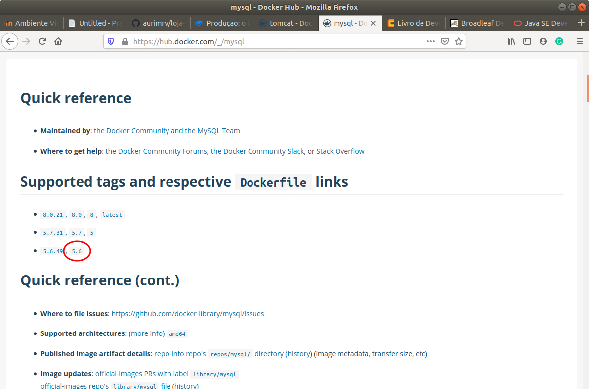

# 2.3 Instalação do Servidor de Banco de Dados

O primeiro servidor que iremos configurar será o servidor de banco de dados. Na terminologia Docker, vamos criar um arquivo, denominado Dockerfile, responsável por viabilizar a construção de uma imagem Docker. O ponto interessante aqui é que no Dockerfile, podemos utilizar uma imagem já existente e personalizá-la para a nossa realidade. 

Posteriormente, a partir dessa imagem personalizada, criamos o contêiner que irá executar para o funcionamento da aplicação.

No caso do nosso servidor de banco de dados, nosso Dockerfile ficou assim:

```text
FROM mysql:5.6

LABEL maintainer="auri@ufscar.br, g4briel.4lves@gmail.com"

ENV MYSQL_ROOT_PASSWORD secret
ENV MYSQL_DATABASE loja_schema
ENV MYSQL_USER loja
ENV MYSQL_PASSWORD=lojasecret

COPY schema.sql /docker-entrypoint-initdb.d

EXPOSE 3306
```

Vamos detalhar cada linha desse arquivo a seguir. Para uma documentação completa de tudo o que o Dockerfile pode conter e a sintaxe de cada comando recomenda-se fortemente a [documentação oficial do Dockerfile](https://docs.docker.com/engine/reference/builder/). 

Na linha 1, especificamos qual a imagem que queremos personalizar, no caso, estamos utilizando uma imagem do mysql, especificamente, a da versão 5.6. Todas as opções de imagens disponíveis estáo no Docker Hub. A imagem abaixo, ilustra as versões do MySQL ofical que existem lá e em destaque, a que fazemos uso. Desse modo, para fazer uso de determinada versão, basta colocar o nome da imagem, seguido de ":", seguido da versão desejada conforme documentado no Docker Hub. Se desejássemos a última versão, pode exemplo, poderíamos utilizar apenas `mysql`, ou então `mysql:latest`.

```text
FROM mysql:5.6
```



A terceira linha, definimos um rótulo que indica os mantenedores desse arquivo de imagem:

```text
LABEL maintainer="auri@ufscar.br, g4briel.4lves@gmail.com"
```

Nas linhas de 5 a 8, instanciamos quatro variáveis de ambiente que serão utilizadas pela imagem para a instanciação do banco de dados conforme desejamos.

```text
ENV MYSQL_ROOT_PASSWORD secret
ENV MYSQL_DATABASE loja_schema
ENV MYSQL_USER loja
ENV MYSQL_PASSWORD=lojasecret
```

A primeira, `ENV MYSQL_ROOT_PASSWORD secret`, indica para o MySQL qual a senha que será utilizada para acesso `root`.

As demais são específicas para a aplicação em questão e indicam, respectivamente, o nome da base de dados que o sistema utiliza \(`ENV MYSQL_DATABASE loja_schema`\), o usuário que tem acesso a essa base de dados \(`ENV MYSQL_USER loja`\) e a senha desse usuário \(`ENV MYSQL_PASSWORD=lojasecret`\).

Na linha 10, inserimos na imagem um script SQL que contém instruções importantes a serem executadas na instanciação do banco de dados. Todos os scripts incluídos em `docker-entrypoint-initdb.d` são executados durante a inicialização do contêiner e, desse modo, tais ações são refletidas no banco de dados que iremos utilizar.

```text
COPY schema.sql /docker-entrypoint-initdb.d
```

No nosso caso, a única coisa que fazemos dentro desse script é remover o usuário anônimo do servidor de banco de dados MySQL. O conteúdo do arquivo `schema.sql` é dado abaixo.

```text
DELETE FROM mysql.user WHERE user = '';
```

Finalmente, a última linha do Dockerfile indica que os contêineres criados a partir dessa imagem irão expor o porto 3306, que é o porto padrão de conexão ao banco MySQL. Isso é o que permite o acesso ao contêiner por uma aplicação externa ou até mesmo por outro contêiner.

```text
EXPOSE 3306
```

#### Contruindo a imagem do Servidor de Bando de Dados partir do Dockerfile

Uma vez criado o Dockerfile e todos os recursos que ele utiliza estarem disponíveis é possível construir uma imagem atualizada para atender as nossas necessidades.

Para facilitar a criação do nossos contêineres, no link abaixo é possível clonar o repositório que contém o Dockerfile e demias arquivos para a criação do nosso servidor MySQL.

```text
git clone https://github.com/aurimrv/devops-extra
```

Será clonado o repositório e, dentro do diretório `devops-extra`, terá o diretório `cap-02/docker-mysql-image`, com o conteúdo dos arquivos acima.

O primeiro passo, é construir a imagem do servidor com os comandos abaixo:

```text
$ cd devops-extra/cap-02/docker-mysql-image/
$ docker build -t mysql-server-img .
```

Como resultado do comando acima, o Docker fará o download da imagem do `mysql:5.6` conforme solicitado e irá personalizá-la segundo as instruções do Dockerfile. O resultado é exibido abaixo:

```text
Sending build context to Docker daemon  3.072kB
Step 1/8 : FROM mysql:5.6
 ---> 44241dbd4d38
Step 2/8 : LABEL maintainer="auri@ufscar.br, g4briel.4lves@gmail.com"
 ---> Using cache
 ---> 1ae60806dec0
Step 3/8 : ENV MYSQL_ROOT_PASSWORD secret
 ---> Using cache
 ---> 011ad589772a
Step 4/8 : ENV MYSQL_DATABASE loja_schema
 ---> Using cache
 ---> 134f18062076
Step 5/8 : ENV MYSQL_USER loja
 ---> Using cache
 ---> 6b750c28904d
Step 6/8 : ENV MYSQL_PASSWORD=lojasecret
 ---> Using cache
 ---> f7e48b89469f
Step 7/8 : COPY schema.sql /docker-entrypoint-initdb.d
 ---> acdd5b058995
Step 8/8 : EXPOSE 3306
 ---> Running in 555f55bac1af
Removing intermediate container 555f55bac1af
 ---> ef8d47d703c7
Successfully built ef8d47d703c7
Successfully tagged mysql-server:latest
```

A partir desse pondo, temos uma imagem pronta para ser utilizada para a criação de contêineres, conforme a nossa necessidade.

#### Inicializando o contêiner do Servidor de Banco de Dados

Nessa seção, iremos criar o contêiner, a partir da imagem criada acima, que servirá como o servidor de banco de dados para a nossa aplicação da loja virtual.

O comando Docker para a criação de um contêiner a partir de uma imagem é o `docker run`. No nosso caso, ele será executado com os parâmetros abaixo, explicados a seguir.

```text
docker run --name mysql-server -v data:/var/lib/mysql -p 3306:3306 mysql-server-img
```

A imagem abaixo, apresenta um trecho da saída produzida pela execução do comando acima.

```text
2020-09-17 18:40:02+00:00 [Note] [Entrypoint]: Entrypoint script for MySQL Server 5.6.49-1debian9 started.
2020-09-17 18:40:02+00:00 [Note] [Entrypoint]: Switching to dedicated user 'mysql'
2020-09-17 18:40:02+00:00 [Note] [Entrypoint]: Entrypoint script for MySQL Server 5.6.49-1debian9 started.
2020-09-17 18:40:02+00:00 [Note] [Entrypoint]: Initializing database files
...
...
...
2020-09-17 18:40:15 1 [Warning] 'proxies_priv' entry '@ root@3d386713c011' ignored in --skip-name-resolve mode.
2020-09-17 18:40:15 1 [Note] Event Scheduler: Loaded 0 events
2020-09-17 18:40:15 1 [Note] mysqld: ready for connections.
Version: '5.6.49'  socket: '/var/run/mysqld/mysqld.sock'  port: 3306  MySQL Community Server (GPL)
```

Observe que o servidor permanece em execução dentro do contêiner e o prompt não é liberado. Para verificar o status dos contêineres pode-se utilizar o comando `docker ps -a`. Isso mostra o status de todos os contêineres disponíveis em execução ou não.

Por exemplo, a execução do comando nesse momento resultaria numa saída semelhante a ilustrada abaixo:

```text
$ docker ps -a
CONTAINER ID        IMAGE               COMMAND                  CREATED             STATUS              PORTS                    NAMES
3d386713c011        mysql-server-img        "docker-entrypoint.s…"   5 minutes ago       Up 5 minutes        0.0.0.0:3306->3306/tcp   mysql-server
```

Observe que tais informações são importantes para monitorarmos o status de cada contêiner no nosso sistema. Ele apresenta o 1\) Container ID, que identifica unicamente um contêiner; 2\) qual a imagem que o originou; 3\) qual o ponto de entrada do contêiner; 4\) quando foi criado; 5\) se está em execução \(Up\) ou não; 6\) quais portas o contêiner expõe; e 6\) os nomes dos contêineres.

Agora vamos analisar os parâmetros do comando `docker run` acima.

O primeiro parâmetro `--name mysql-server`, permite nomear o contêiner para, posteriormente, utilizarmos esse nome, ao invés do `Conteiner ID`, para a execução de outros comandos Docker. Isso porque, uma vez que o contêiner é criado, o Docker atribui a esse contêiner um identificador, denominado `Conteiner ID` e um nome genérico, caso o parâmetro `--name` não seja utilizado.

Por exemplo, se desejar obter informações detalhadas sobre um contêiner específico, pode-se utilizar o comando docker inspect. Esse comando aceita de parâmetro ou o Contêiner ID ou seu nome. No exemplo acima, ele funcionaria de maneira idêntica se fosse utilizado:

```text
docker inspect mysql-server

ou

docker inspect 3d386713c011
```

Continuando, o segundo parâmetro, `-v data:/var/lib/mysql`, permite a criação de um volume de dados que pode ser compartilhado entre o sistema hospedeiro e o contêiner. No caso, o diretório local `data` será "conectado" ao diretório `/var/lib/mysql` do contêiner. Desse modo, dados existentes em `data` passam a ser visíveis dentro do contêiner e dados produzidos durante a execução do contêiner em `/var/lib/mysql` são salvos também fora do contêiner no diretório local `data`. Essa é uma forma de persistir os dados gerados pelo contêiner, mesmo após a sua destruição.

O terceiro parâmetro `-p 3306:3306` ou `--publish` é permite publicar o porto de um contêiner para fora dele. Por padrão, um contêiner não publica seus portos para acesso externo. No caso de nossa imagem, informamos que ela iria expor o porto 3306. O parâmetro `-p` indica isso. O segundo número é o número do porto no contêiner, 3306, e o primeiro é qual número de porto queremos utilizar no localhost. No caso, optamos por usar o mesmo por não haver conflito. Mas poderia ser algo do tipo: `-p 3310:3306` , em que o porto 3306 do contêiner estará acessível no localhost no porto 3310, por exemplo.

Finalmente, o último parâmetro é o nome da imagem a partir da qual iremos criar um contêiner. No exemplo acima, o nome da imagem utilizada no comando `docker build` foi `mysql-server`.

#### Certificando que o contêiner em execução está correto para uso com a aplicação

Após a execução do `docker run`, ilustrado acima, o contêiner está em funcionamento. É possível se conectar a ele e abrir um prompt para a execução de comandos via mysql. Por exemplo, para ter certeza que as configurações exigidas para a loja virtual estão corretas, tais como, nome da base, usuário e senhas de acesso, é possível utilizar o comando abaixo:

```text
docker exec -it mysql-server bash
```

O comando `docker exec` permite executar um comando dentro da máquina especificada. No caso, estamos solicitando a execução do `bash`, dentro do contêiner `mysql-server` de forma interativa \(parâmetro `-it`\).

Como resultado, será aberto um prompt `bash` dentro do contêiner, conforme ilustrado abaixo:

```text
$ mysql -uloja -p
Enter password: 
Welcome to the MySQL monitor.  Commands end with ; or \g.
Your MySQL connection id is 2
Server version: 5.6.49 MySQL Community Server (GPL)

Copyright (c) 2000, 2020, Oracle and/or its affiliates. All rights reserved.

Oracle is a registered trademark of Oracle Corporation and/or its
affiliates. Other names may be trademarks of their respective
owners.

Type 'help;' or '\h' for help. Type '\c' to clear the current input statement.

mysql> show databases;
+--------------------+
| Database           |
+--------------------+
| information_schema |
| loja_schema        |
+--------------------+
2 rows in set (0.20 sec)

mysql> exit;
Bye
$ CTRL+D
```

No exemplo, foi utilizado o usuário `loja`, com a senha `lojasecret`, conforme documentado no `Dockerfile` e, além disso, ao consultar as bases de dados disponíveis, observa-se que existe a base `loja_schema` disponível para uso desse usuário. 

Observa-se que a execução do comando `exec` não cria um novo contêiner, ele apenas permite a execução de um comando dentro do contêiner em execução. Ao se pressionar `CTRL+D` no prompt, conforme ilustrado na linha 26 acima, essa execução é encerrada mas, o contêiner, continua em execução. Para se ter certeza disso basta executar um `docker ps` para confirmar.

```text
$ docker ps -a
CONTAINER ID        IMAGE               COMMAND                  CREATED             STATUS              PORTS                    NAMES
3d386713c011        mysql-server-img        "docker-entrypoint.s…"   3 hours ago         Up 3 hours          0.0.0.0:3306->3306/tcp   mysql-server
```

#### Descobrindo o IP do servidor de banco de dados

Perfeito até aqui. Uma última coisa que é necessário descobrir para continuar com a configuração do Servidor Web é descobrir qual o número IP que o contêiner do servidor de banco de dados está usando. Para isso utilizaremos o comando `docker inspect` que fornece todos os detalhes de um contêiner em execução. Para simplificar a saída de dados, será aplicado um filtro para que seja exibido apenas a informação que necessitamos mas, se estiver curioso para ver tudo o que esse comando pode lhe mostrar basta chamar apenas como `docker inspect mysql-server`. No nosso caso, como resultado, observa-se que o servidor MySQL está em execução no IP `172.17.0.2`. Possivelmente, na sua máquina, aparecerá um número diferente. Anote-o pois será necessário usá-lo na próxima seção para configurar a integração do Servidor Web com o servidor de banco de dados. 

```text
$ docker inspect -f '{{range .NetworkSettings.Networks}}{{.IPAddress}}{{end}}' mysql-server
172.17.0.2
```


