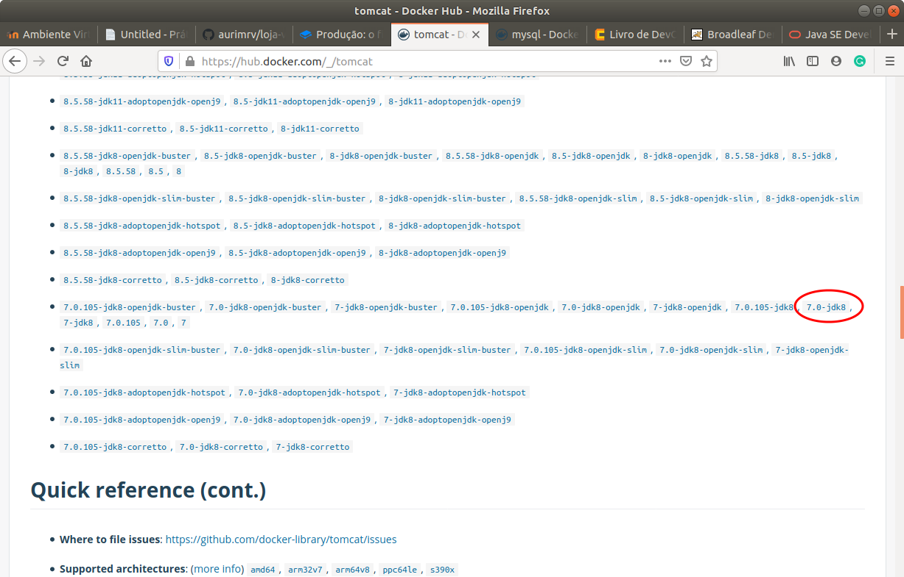
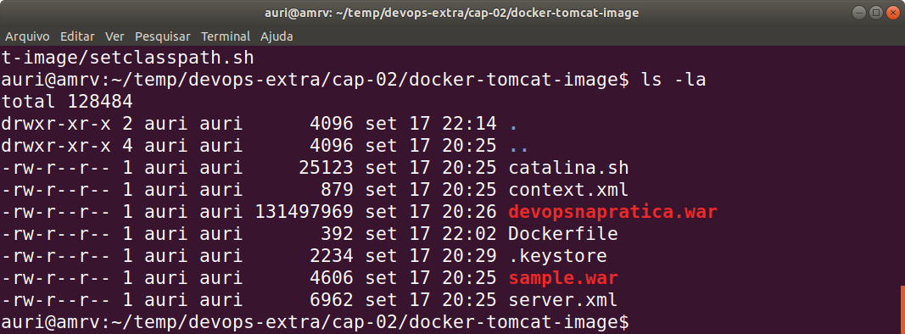
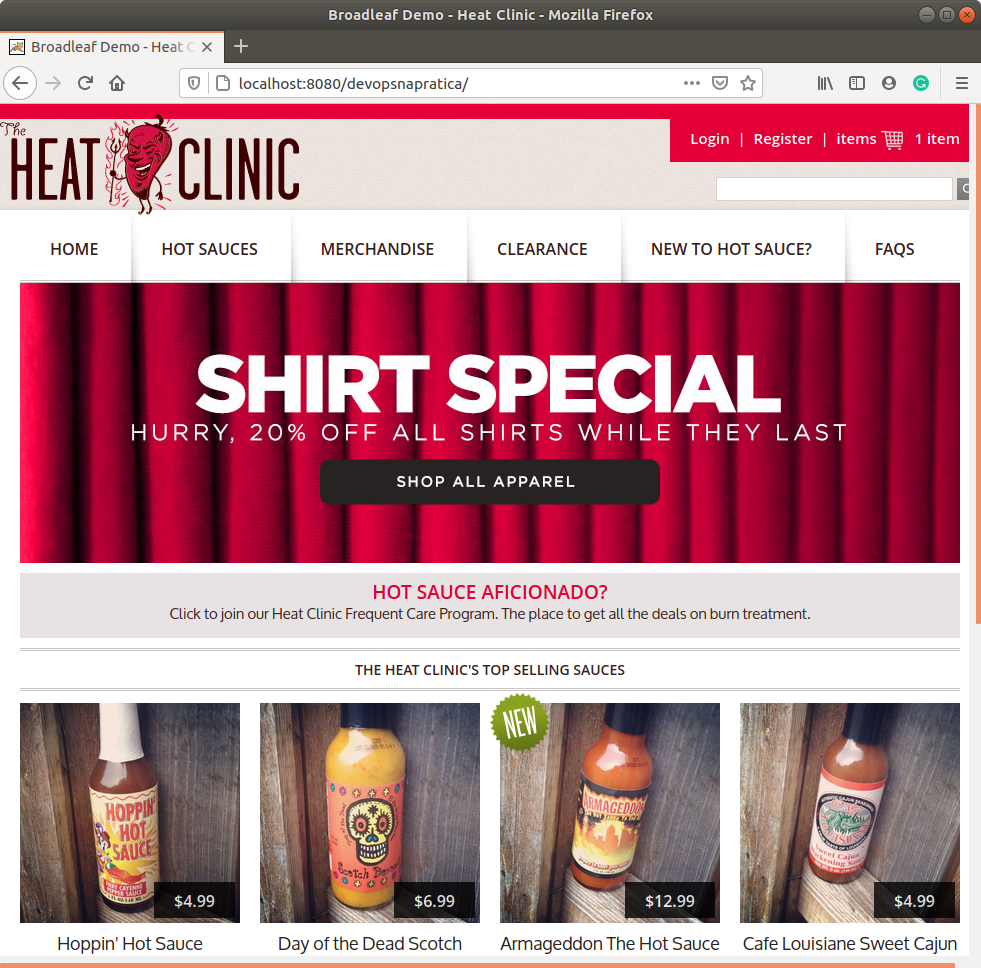
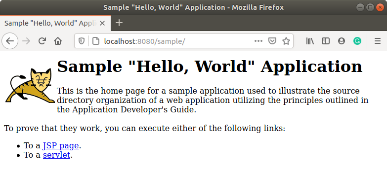
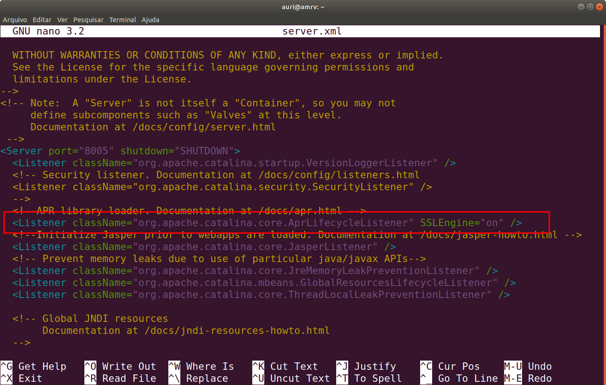
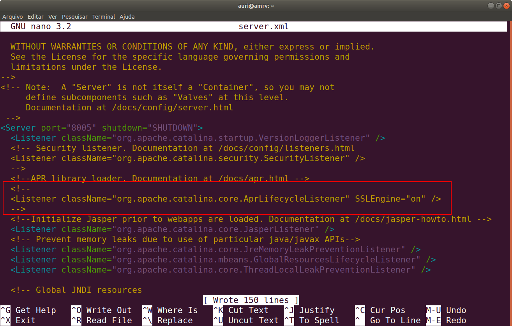
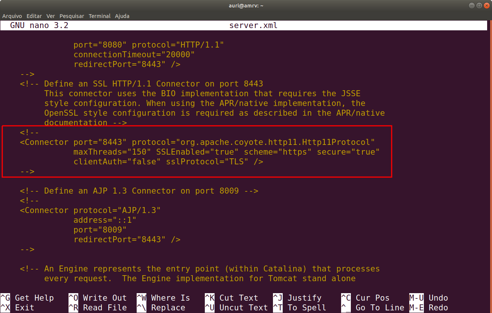
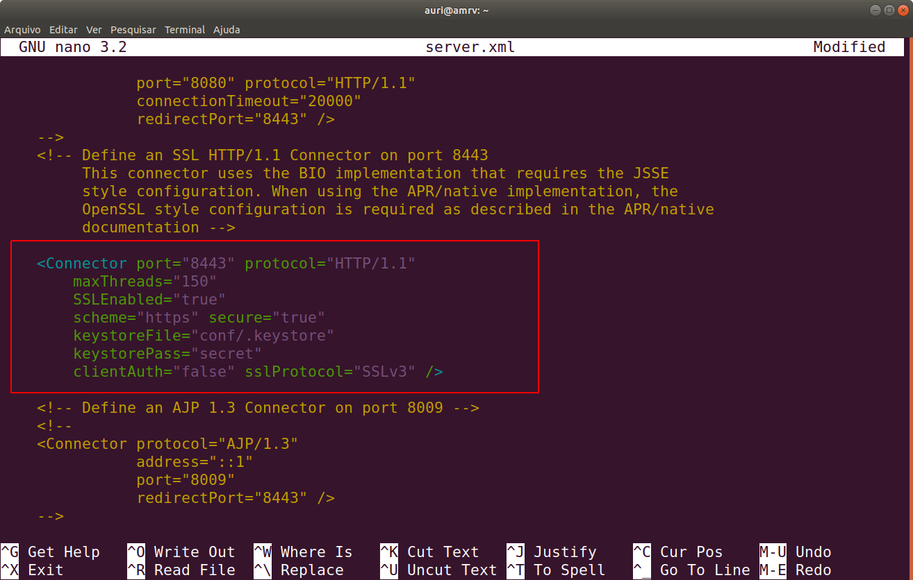
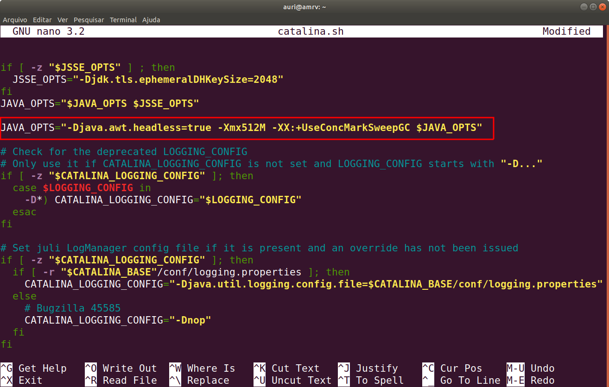
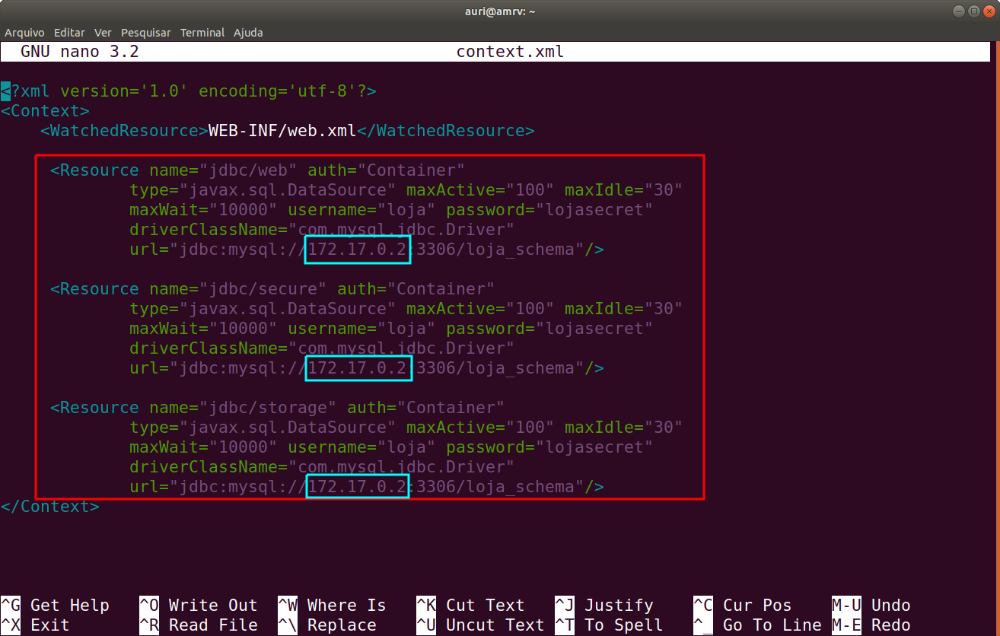

# 2.4 Instalação do Servidor de Web

Na seção anterior verificamos como configurar e instanciar um contêiner a partir de uma imagem Docker do MySQL personalizada. Nessa seção faremos o mesmo processo, entretanto, utilizando uma imagem Docker do [Tomcat](https://hub.docker.com/_/tomcat), que será personalizada para atender às necessidades de nossa [Loja Virtual](https://github.com/aurimrv/loja-virtual-devops).

No caso do Servidor Web, há muito mais coisas para se fazer para atender aos requisitos da aplicação. Se você for curioso e quiser tentar replicar o que foi feito sugiro a leitura da última seção parte do livro. Na parte inicial, vou assumir que vocês querem colocar as coisas para funcionar e, para isso, bastaria personalizarmos a imagem original do Tomcat para atender as nossas necessidades. Assim sendo, vamos lá.

No caso do nosso Servidor Web, nosso `Dockerfile` ficou assim:

```text
FROM tomcat:7.0-jdk8

LABEL maintainer="auri@ufscar.br, g4briel.4lves@gmail.com"

ADD catalina.sh /usr/local/tomcat/bin/
ADD .keystore /usr/local/tomcat/conf/
ADD server.xml /usr/local/tomcat/conf/
ADD context.xml /usr/local/tomcat/conf/
ADD sample.war /usr/local/tomcat/webapps/
ADD devopsnapratica.war /usr/local/tomcat/webapps/

EXPOSE 8080

RUN chmod a+x /usr/local/tomcat/bin/catalina.sh

CMD ["catalina.sh", "run"]
```

Observe na linha 1 \(`FROM tomcat:7.0-jdk8`\) que estamos utilizando uma versão 7 do Tomcat, que tenha junto nessa imagem um JDK 1.8, que é o pré-requisito para a execução de nossa aplicação. 



Essa é outra vantagem que os contêineres nos apresentam. No [Docker Hub](https://hub.docker.com) há uma grande quantidade de imagens de contêineres, mesmo de tecnologias menos atuais, mas que podem ser utilizadas para continuar executando um produto antes que o mesmo passe por uma manutenção e seja atualizado para tecnologias mais novas.

Entre as linhas 5 a 10, basicamente alteramos as configurações da imagem original, sobrescrevendo arquivos de configuração do Tomcat. Observe que o arquivo da linha 6 \(`.keystore`\) é um arquivo oculto e, quando fizer o download, utilize a opção de exibir arquivos ocultos no gerenciador de arquivos ou o comando `ls -la` para visualizá-lo no prompt de comando.

Além disso, nas linhas 9 e 10 são feitos os deploys de duas aplicações no Tomcat. A primeira é uma aplicação exemplo simples que executa sem a necessidade de alterar qualquer configuração do servidor Tomcat. A segunda  é a nossa loja virtual. 

**IMPORTANTE: Como o arquivo tem mais de 100Mb  ele não estará no repositório clonado do GitHub e terá que ser baixado do link abaixo e colocando junto com os demais arquivos antes de realizar o processo de construção da imagem Docker.**

\*\*\*\*[**Clique aqui para realizar o download do arquivo devopsnapratica.war**](https://drive.google.com/file/d/1xW9-hM0p6VxB4E5QduvWvEVbORA0j6Gc/view?usp=sharing)**.**

Na ultima parte deste Seção 2.4 explico como esses arquivos de configuração foram gerados. Basicamente,  o que se fez foi inicializar o servidor em sua imagem original compartilhando um volume de dados local. Com o servidor ativo, conectou-se no contêiner via prompt `bash`, em seguida, os arquivos de configuração originais foram alterados/gerados conforme documentação da Loja Virtual disponível no Capítulo 2 do [Sato \(2018\)](https://www.casadocodigo.com.br/products/livro-devops) e, finalmente, tais arquivos foram copiados para a pasta compartilhada para poderem ser utilizados na configuração de uma imagem personalizada.

Um desses arquivos é dependente da instalação, que é o `context.xml`. Assim que fizer o download do mesmo e inicializar o servidor de banco de dados, é necessário descobrir qual o IP do servidor de banco de dados, conforme mencionado no último item da Seção 2.3. Na minha instalação esse IP foi o `172.17.0.2`. Dentro o arquivo `context.xml` é necessário atualizar esse IP caso o seu seja diferente. Há três pontos para serem atualizados, linhas 9, 15 e 21, como pode ser observado no arquivo apresentado abaixo:

```text
<?xml version='1.0' encoding='utf-8'?>
<Context>
  <WatchedResource>WEB-INF/web.xml</WatchedResource>

 	<Resource name="jdbc/web" auth="Container"
		type="javax.sql.DataSource" maxActive="100" maxIdle="30"
		maxWait="10000" username="loja" password="lojasecret"
		driverClassName="com.mysql.jdbc.Driver"
		url="jdbc:mysql://172.17.0.2:3306/loja_schema"/>

	<Resource name="jdbc/secure" auth="Container"
		type="javax.sql.DataSource" maxActive="100" maxIdle="30"
		maxWait="10000" username="loja" password="lojasecret"
		driverClassName="com.mysql.jdbc.Driver"
		url="jdbc:mysql://172.17.0.2:3306/loja_schema"/>

	<Resource name="jdbc/storage" auth="Container"
		type="javax.sql.DataSource" maxActive="100" maxIdle="30"
		maxWait="10000" username="loja" password="lojasecret"
		driverClassName="com.mysql.jdbc.Driver"
		url="jdbc:mysql://172.17.0.2:3306/loja_schema"/>
</Context>
```

Feita essa alteração é possível criar a imagem do Servidor Web. Antes disso, apenas a título de explicação, na linha 12 do `Dockerfile` é possível observar que está sendo exposto o porto `8080`. 

Em seguida, na linha 14, executa-se o comando `chmod`, responsável pela definição dos atributos de execução do arquivo `catalina.sh`. Como o arquivo foi armazenado no repositório do GitHub e nossa cópia do arquivo é utilizada no Dockerfile para sobrescrever o arquivo original da imagem \(linha 5 do Dockerfile\), pode ser que suas permissões de execução estejam alteradas, causando erro na inicialização do servidor. Desse modo, por precaução, tais atributos são redefinidos antes de sua invocação na linha 16.

#### Construindo a imagem do Servidor Web partir do Dockerfile

O processo para a construção da imagem do servidor é idêntico ao que usamos anteriormente, basta invocar o comando `docker build` dentro do diretório onde está o Dockerfile e os demais arquivos utilizados no mesmo. 

O conteúdo do diretório `docker-tomcat-image` deve ser conforme apresentado abaixo:



Chegando a esse conteúdo, basta executar o build da imagem, conforme ilustrado abaixo:

```text
$ cd devops-extra/cap-02/docker-tomcat-image/
$ docker build -t tomcat-server-img .
```

O resultado da execução do comando acima é mostrado abaixo:

```text
Sending build context to Docker daemon  131.5MB
Step 1/10 : FROM tomcat:7.0-jdk8
 ---> f8cee8b799d7
Step 2/10 : LABEL maintainer="auri@ufscar.br, g4briel.4lves@gmail.com"
 ---> Running in d639b320b865
Removing intermediate container d639b320b865
 ---> e830b4b7bab5
Step 3/10 : ADD catalina.sh /usr/local/tomcat/bin/
 ---> 2d3653edf1df
Step 4/10 : ADD .keystore /usr/local/tomcat/conf/
 ---> 2d03dcdda154
Step 5/10 : ADD server.xml /usr/local/tomcat/conf/
 ---> 88aa8eb3500f
Step 6/10 : ADD context.xml /usr/local/tomcat/conf/
 ---> 2dc3b412f923
Step 7/10 : ADD sample.war /usr/local/tomcat/webapps/
 ---> b8a92a919d32
Step 8/10 : ADD devopsnapratica.war /usr/local/tomcat/webapps/
 ---> 80426361c1ef
Step 9/10 : EXPOSE 8080
 ---> Running in 5b9bcb960c73
Removing intermediate container 5b9bcb960c73
 ---> c8f5d9ab8aa1
Step 10/10 : CMD ["catalina.sh", "run"]
 ---> Running in 58ef01b60494
Removing intermediate container 58ef01b60494
 ---> ad4d2f35ee5d
Successfully built ad4d2f35ee5d
Successfully tagged tomcat-server-img:latest
```

#### Inicializando o contêiner do Servidor Web

Finalizada a construção da imagem do servidor e estando ativo o contêiner executando o Servidor de Banco de Dados, é possível inicializar o Servidor Web. Pra isso, será executado o `docker run` na imagem recém criada, conforme ilustrado abaixo.

```text
docker run --name tomcat-server -p 8080:8080 tomcat-server-img
```

De forma semelhante como fizemos com o Servidor de Bando de Dados, nomeamos esse servidor como `tomcat-server`, visando a facilitar a execução de outros comandos Docker sobre o contêiner criado. Além disso, mapeamos a porta `8080` do contêiner, para o porto `8080` local, de modo que a aplicação dique acessível via [http://localhost:8080/devopsnapratica/](http://localhost:8080/devopsnapratica/), no navegador do cliente.

Se tudo correr bem, a saída esperada é semelhante a mostrada abaixo:

```text
Sep 18, 2020 1:06:47 AM org.apache.catalina.startup.VersionLoggerListener log
INFO: Server version name:   Apache Tomcat/7.0.105
Sep 18, 2020 1:06:47 AM org.apache.catalina.startup.VersionLoggerListener log
INFO: Server built:          Jul 2 2020 12:25:26 UTC
Sep 18, 2020 1:06:47 AM org.apache.catalina.startup.VersionLoggerListener log
INFO: Server version number: 7.0.105.0
Sep 18, 2020 1:06:47 AM org.apache.catalina.startup.VersionLoggerListener log
...
...
Sep 18, 2020 1:12:17 AM org.apache.catalina.startup.HostConfig deployWAR
INFO: Deployment of web application archive [/usr/local/tomcat/webapps/devopsnapratica.war] has finished in [328,744] ms
Sep 18, 2020 1:12:17 AM org.apache.catalina.startup.HostConfig deployWAR
INFO: Deploying web application archive [/usr/local/tomcat/webapps/sample.war]
Sep 18, 2020 1:12:17 AM org.apache.catalina.startup.HostConfig deployWAR
INFO: Deployment of web application archive [/usr/local/tomcat/webapps/sample.war] has finished in [160] ms
Sep 18, 2020 1:12:17 AM org.apache.coyote.AbstractProtocol start
INFO: Starting ProtocolHandler ["http-bio-8080"]
Sep 18, 2020 1:12:17 AM org.apache.coyote.AbstractProtocol start
INFO: Starting ProtocolHandler ["http-bio-8443"]
Sep 18, 2020 1:12:17 AM org.apache.catalina.startup.Catalina start
INFO: Server startup in 329127 ms
```

Se você visualizar a mensagem final, conforme linga 21 acima e não observou a ocorrência de erros ou exceções, o seu servidor deve ter inicializado com sucesso.

Desse modo, para testar, basta abrir  o navegador e digitar a URL: [http://localhost:8080/devopsnapratica/](http://localhost:8080/devopsnapratica/). O resultado deve ser a exibição da página principal da nossa Loja Virtual.



A aplicação exemplo \(`sample.war`\) também está disponível e funcionando na URL: [http://localhost:8080/sample/](http://localhost:8080/sample/).



#### Como foram gerados os arquivos de configuração do Servidor Web

Conforme comentado acima, no Dockerfile do Servidor Web alteramos uma série de arquivos no servidor original para viabilizar a execução da aplicação. A seguir, é ilustrado o passo a passo que permitiu a realização dessa configuração.

* [ ] Inicialização de um contêiner com a imagem Docker original do Tomcat 7 - JDK 8 a ser utilizada

```text
mkdir /home/auri/temp/files
docker run --mount type=bind,source=/home/auri/temp/files,target=/home/files \
--name tomcat7 -it tomcat:7.0-jdk8
```

No comando da linha 1, foi criado um diretório `/home/auri/temp/files` que servirá como repositório dos dados dos arquivos de configuração do Servidor Web executando no contêiner após o término de sua execução. No comando `docker run`, na linha 2 e 3 \(é um único comando\), observa-se que esse diretório será associado ao diretório `/home/files` dentro do contêiner. Desse modo, tudo o que for copiado no contêiner nesse diretório `/home/files` será também saldo no disco local na pasta `/home/auri/temp/files`.

Ainda no comando `docker run`, foi atribuído o nome tomcat7 \(`--name tomcat7`\) para esse contêiner e o mesmo irá executar em modo interativo \(`-it`\). `tomcat:7.0-jdk8` corresponde ao nome da imagem do Docker Hub que se deseja utilizar para a criação do contêiner.

A execução desse comando resulta numa saída similar a essa:

```text
Using CATALINA_BASE:   /usr/local/tomcat
Using CATALINA_HOME:   /usr/local/tomcat
Using CATALINA_TMPDIR: /usr/local/tomcat/temp
Using JRE_HOME:        /usr/local/openjdk-8
Using CLASSPATH:       /usr/local/tomcat/bin/bootstrap.jar:/usr/local/tomcat/bin/tomcat-juli.jar
Sep 18, 2020 2:41:17 AM org.apache.catalina.startup.VersionLoggerListener log
INFO: Server version name:   Apache Tomcat/7.0.105
Sep 18, 2020 2:41:17 AM org.apache.catalina.startup.VersionLoggerListener log
...
...
...
INFO: Starting service [Catalina]
Sep 18, 2020 2:41:18 AM org.apache.catalina.core.StandardEngine startInternal
INFO: Starting Servlet Engine: Apache Tomcat/7.0.105
Sep 18, 2020 2:41:18 AM org.apache.coyote.AbstractProtocol start
INFO: Starting ProtocolHandler ["http-apr-8080"]
Sep 18, 2020 2:41:18 AM org.apache.catalina.startup.Catalina start
INFO: Server startup in 78 ms
```

Inicializado o contêiner, o próximo passo é conectar no mesmo para realizar as alterações nos arquivos de configuração. Isso é feito com o comando abaixo:

```text
docker exec -it tomcat7 /bin/bash
```

Que resulta na abertura de um prompt de comando no servidor, conforme ilustrado abaixo:

```text
root@e6dd11809afa:/usr/local/tomcat#
```

Observa-se que nesse prompt estamos conectados com poder de administrador dentro do Servidor Web.

Em seguida iniciaremos a instalação de ferramentas e a edição dos arquivos de configuração conforme os passos a seguir.

```text
	apt update

	apt -y install nano
```

Os comandos acima, atualizam a base de pacotes dentro do contêiner e instala o editor de texto nano, uma vez que a imagem do contêiner tem apenas com o essencial para a execução do Tomcat.

**Gerando o arquivo `.keystore`**

A primeira configuração a ser feita é a utilização da ferramenta `keytool` para a geração do certificado que o nosso Servidor Web irá precisar. São solicitadas várias informações no processo exibidas a seguir. Ao solicitar a senha, utilizaremos `secret`, conforme configurações anteriores.

A execução do `keytool` deve ser feita conforma ilustrado a seguir, dentro do diretório `/usr/local/tomcat/conf/` do Tomcat 7.

```text
cd /usr/local/tomcat/conf/
keytool -genkey -alias tomcat -keyalg RSA -keystore .keystore
```

Em seguida serão solicitadas as informações apresentadas a seguir. Lembre-se de fornecer a senha `secret` como _password_.

```text
Enter keystore password:  
	Re-enter new password: 
	What is your first and last name?
	  [Unknown]:  Loja Virtual
	What is the name of your organizational unit?
	  [Unknown]:  DevOps           
	What is the name of your organization?
	  [Unknown]:  UFSCar
	What is the name of your City or Locality?
	  [Unknown]:  Sao Carlos
	What is the name of your State or Province?
	  [Unknown]:  SP
	What is the two-letter country code for this unit?
	  [Unknown]:  BR
	Is CN=Loja Virtual, OU=Devopss, O=UFSCar, L=Sao Carlos, ST=SP, C=BR correct?
	  [no]:  yes
```

Ao final desse processo, dentro da pasta `/usr/local/tomcat/conf/`será gerado o arquivo `.keystore` que será necessário posteriormente na personalização da nossa imagem do Servidor Web. Desse modo, esse arquivo será copiado para a pasta `/home/files`.

**Editando o arquivo `server.xml`**

O próximo passo consiste na edição do arquivo `server.xml`, também localizado em `/usr/local/tomcat/conf/` para habilitar a autenticação por SSL no porto 8443. As alterações a serem feiras estão exibidas nas telas abaixo no antes e depois do arquivo `server.xml`. 

A primeira parte consiste em comentar uma linha do arquivo `server.xml`. As imagens abaixo ilustram o antes e o depois e destacam a linha comentada.





A segunda edição consiste em remover os comentários e habilitar a conexão via SSL no porto 8443, conforme as imagens abaixo demonstrando o antes e o depois.

O texto inserido é esse mostrado no código abaixo.

```text
    <Connector port="8443" protocol="HTTP/1.1"
        maxThreads="150" 
        SSLEnabled="true" 
        scheme="https" secure="true" 
        keystoreFile="conf/.keystore"
        keystorePass="secret"
        clientAuth="false" sslProtocol="SSLv3" />
```





Com isso, encerra-se a edição do arquivo `server.xml` e o mesmo também pode ser copiado para a pasta `/home/files` para ser utilizado posteriormente na geração da imagem personalizada.

**Editando o arquivo `catalina.sh`**

O penúltimo passo é editar o arquivo `catalina.sh` , localizado em `/usr/local/tomcat/bin`, para aumentarmos o tamanho da área de memória a ser utilizada pelo Tomcat 7 na execução de aplicação. Neste, basta incluir a instrução abaixo, logo após a primeira ocorrência da variável `JAVA_OPTS` dentro do arquivo fora da área de comentários.

O conteúdo a ser incluído é:

```text
JAVA_OPTS="-Djava.awt.headless=true -Xmx512M -XX:+UseConcMarkSweepGC $JAVA_OPTS"
```

A figura abaixo ilustra o ponto de edição em destaque.



**Edição do arquivo `context.xml`**

Finalmente, o último arquivo a ser alterado é o `context.xml` , localizado em `/usr/local/tomcat/conf`. A alteração nesse arquivo é necessária para indicar ao Tomcat onde estão as fontes de dados no JNDI \(_Java Naming and Directory Interface_\) utilizadas pela aplicação da Loja Virtual. São três as fontes, a saber: `jdbc/web` , `jdbc/secure` e `jdbc/storage`. Como será utilizado o mesmo banco de dados para as três fontes de dados, o IP do Servidor de Banco de Dados é o mesmo para as três.

```text
<Resource name="jdbc/web" auth="Container"
        type="javax.sql.DataSource" maxActive="100" maxIdle="30"
         maxWait="10000" username="loja" password="lojasecret"
         driverClassName="com.mysql.jdbc.Driver"
         url="jdbc:mysql://172.17.0.2:3306/loja_schema"/>

<Resource name="jdbc/secure" auth="Container"
         type="javax.sql.DataSource" maxActive="100" maxIdle="30"
         maxWait="10000" username="loja" password="lojasecret"
         driverClassName="com.mysql.jdbc.Driver"
         url="jdbc:mysql://172.17.0.2:3306/loja_schema"/>

<Resource name="jdbc/storage" auth="Container"
         type="javax.sql.DataSource" maxActive="100" maxIdle="30"
         maxWait="10000" username="loja" password="lojasecret"
         driverClassName="com.mysql.jdbc.Driver"
         url="jdbc:mysql://172.17.0.2:3306/loja_schema"/>
```

A figura a seguir ilustra onde o código acima foi inserido no arquivo `context.xml`, sem os comentários, e com destaque no trecho incluído.



**Copiando arquivos editados para a pasta compartilhada com o host**

Finalizada a criação e edição dos arquivos de configuração, resta agora copiá-los para a pasta compartilhada para que, após o encerramento do contêiner, tais arquivos fiquem disponíveis para serem utilizados na personalização da imagem Docker original de modo que a mesma atenda às necessidades da aplicação.

Os comandos abaixo realizam esse trabalho:

```text
cp /usr/local/tomcat/conf/.keystore /home/files
cp /usr/local/tomcat/conf/serverl.xml /home/files
cp /usr/local/tomcat/bin/catalina.sh /home/files
cp /usr/local/tomcat/conf/context.xml /home/files
```

Desse modo, observa-se que esses foram os arquivos que se utilizou dentro do Dockerfile para a geração da imagem do Servidor Web, realizando o processo inverso, ou seja sobrescrevendo os arquivos originais da imagem do Tomcat 7 armazenada no Docker Hub e viabilizando a criação de nossa imagem personalizada.

