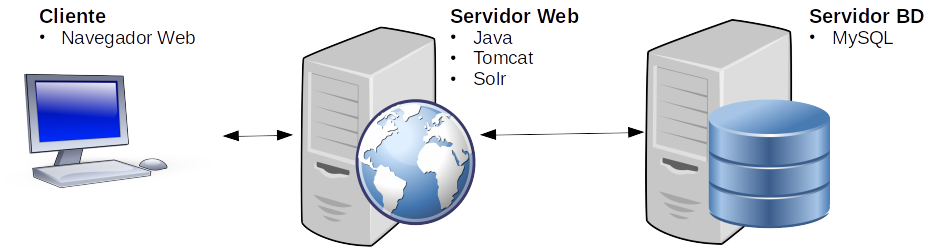

# 2.1 Produção: o fim ou o início?

Neste capítulo falamos sobre o ambiente de produção. Conforme comentado no livro "[DevOps na Prática: Entrega de Software Confiável a Automatizada](https://www.casadocodigo.com.br/products/livro-devops)", Sato argument que o ciclo de vida do software deveria iniciar somente apenas quando o usuário passasse a fazer uso do software.

Particularmente, considero uma afirmação interessante. Do ponto de vista de desenvolvimento de software, sabe-se que bons produtos de software ficam no mercado por mais de 20 anos. Desse modo, se comparado com o tempo de desenvolvimento do produto e o primeiro lançamento, pode-se dizer que o software passa muito mais tempo em manutenção do que em desenvolvimento.

A ideia deste capítulo é ilustrar como podemos utilizar o Docker para montar o ambiente de produção e disponibilizar uma aplicação para ser utilizada pelo usuário final.

Recapitulando a figura do Capítulo 1 que ilustra um fluxo DevOps, esse capítulo abordará o item 5 da figura, ou seja, o ambiente de produção.


Será utilizado como exemplo, o código de uma loja virtual web, o mesmo utilizado por [Sato \(2018\) em seu livro DevOps na Prática](https://www.casadocodigo.com.br/products/livro-devops), mas, ao contrário daquele que fazia uso do Vagrant e Máquinas Virtuais para a instanciação do ambiente de produção, aqui faremos uso do Docker e contêineres.

### 2.1.1 Aplicação exemplo: loja virtual

O objeto do livro é ensinar conceitos de DevOps e não de desenvolvimento de software. Desse modo, faremos uso de uma aplicação já pronta para explorar os conceitos de conteinerização e Docker. Caso deseje, você pode utilizar uma aplicação que tenha familiaridade ou então utilizar a loja virtual do exemplo abaixo. Como citado anteriormente, é a mesma aplicação utilizada no livro [DevOps na Prática](https://www.casadocodigo.com.br/products/livro-devops), por se tratar de uma aplicação mais antiga, buscou-se por contêineres mais próximos da versão original do código, mesmo assim, foram feitas atualizações nas versões dos Plugings do Maven para torná-la compatível e poder ser executada. Trata-se de uma aplicação web escrita em Java e que faz uso da plataforma _Broadleaf Commerce_ \([http://www.broadleafcommerce.org/](http://www.broadleafcommerce.org/)\) para oferecer todos os recursos de uma loja virtual. A aplicação executa em um contêiner Tomcat versão 7 e também necessita de um banco de dados MySQL versão 5.6 que, no nosso caso, estará em outro contêiner. 

Repositório da aplicação: [https://github.com/aurimrv/loja-virtual-devops/](https://github.com/aurimrv/loja-virtual-devops/)

Um ponto importante a ser ressaltado é que, para compilar essa versão da aplicação será necessário fazer uso do Java 1.8.0. Eu utilizei o [JDK 1.8 da Oracle](https://www.oracle.com/br/java/technologies/javase/javase-jdk8-downloads.html). Além disso, assume-se que o `git` e o `maven` estejam instalados e funcionando. 

Para mais detalhes sobre o _Broadleaf Commerce_ sugiro a leitura da Seção 2.1, do Capítulo 2, do livro [DevOps na Prática](https://www.casadocodigo.com.br/products/livro-devops) ou mesmo da documentação oficial em [http://www.broadleafcommerce.org/](http://www.broadleafcommerce.org/).

Para gerar o arquivo `.war` para o deploy no servidor Web basta os comandos abaixo:

```text
$ git clone https://github.com/aurimrv/loja-virtual-devops/
$ cd loja-virtual-devops/
$ mvn package
```

Se tudo correr bem, o resultado final será semelhante ao obtido abaixo:

```text
$ mvn package
[INFO] Scanning for projects...
[INFO] ------------------------------------------------------------------------
[INFO] Reactor Build Order:
[INFO] 
[INFO] loja-virtual-devops                                                [pom]
[INFO] core                                                               [jar]
[INFO] admin                                                              [war]
[INFO] site                                                               [war]
[INFO] combined                                                           [war]
[INFO] 
[INFO] -------------< br.com.devopsnapratica:lojavirtual-website >-------------
[INFO] Building loja-virtual-devops 1.0                                   [1/5]
[INFO] --------------------------------[ pom ]---------------------------------
...
[INFO] 
[INFO] --- maven-war-plugin:2.1.1:war (default-war) @ combined ---
[INFO] Packaging webapp
[INFO] Assembling webapp [combined] in [/home/auri/temp/loja-virtual-devops/combined/target/devopsnapratica]
[INFO] Processing war project
[INFO] Copying webapp resources [/home/auri/temp/loja-virtual-devops/combined/src/main/webapp]
[INFO] Processing overlay [ id admin-js]
[INFO] Processing overlay [ id site-regular]
[INFO] Processing overlay [ id admin-regular]
[INFO] Webapp assembled in [22089 msecs]
[INFO] Building war: /home/auri/temp/loja-virtual-devops/combined/target/devopsnapratica.war
[INFO] WEB-INF/web.xml already added, skipping
[INFO] ------------------------------------------------------------------------
[INFO] Reactor Summary for loja-virtual-devops 1.0:
[INFO] 
[INFO] loja-virtual-devops ................................ SUCCESS [  0.005 s]
[INFO] core ............................................... SUCCESS [  9.168 s]
[INFO] admin .............................................. SUCCESS [ 28.115 s]
[INFO] site ............................................... SUCCESS [ 11.100 s]
[INFO] combined ........................................... SUCCESS [ 34.482 s]
[INFO] ------------------------------------------------------------------------
[INFO] BUILD SUCCESS
[INFO] ------------------------------------------------------------------------
[INFO] Total time:  01:23 min
[INFO] Finished at: 2020-09-17T15:27:38-03:00
[INFO] ------------------------------------------------------------------------

```

O arquivo que será utilizado para o deploy no servidor web estará localizado em `loja-virtual-devops/combined/target/devopsnapratica.war`

Para essa atividade, mesmo que não tenha conseguido gerar o arquivo acima, você pode continuar pois o mesmo será disponibilizado, já compilado, para a criação da imagem do contêiner do servidor, na Seção 2.4.

De modo geral, a aplicação da loja virtual faz uso de uma série de tecnologias Java, tais como frameworks, e servidores de aplicação, além de banco de dados MySQL. Desse modo, seu processo de instalação e configuração corresponde ao de uma aplicação Java completa pois a mesma faz uso de diferentes tecnologias comumente utilizadas em aplicações Java para a web. A figura abaixo, adapta de [Sato \(2018\)](https://www.casadocodigo.com.br/products/livro-devops), ilustra a composição do ambiente de produção.



Os clientes terão acesso à aplicação por meio de um navegador e farão acesso à loja virtual que estará executando no Tomcat dentro do servidor web. O servidor web é responsável por executar a aplicação e contém todos os pré-requisitos necessários para esse fim, ou seja, contém todas as todas as bibliotecas e frameworks Java necessárias, incluindo uma instância embutida do [Apache Solr](https://lucene.apache.org/solr/), que se trata de um servidor de pesquisa para indexação dos itens da loja. A aplicação demanda também um servidor de bando de dados \(Servidor BD\) que estará executando em outro servidor. Desse modo, pode-se dizer que essa seria uma arquitetura web de duas camadas presente em grande parte dos produtos desenvolvidos para a web.


